## 0.前期准备工作

OPNsense 是基于 FreeBSD 的开源防火墙系统，可以在虚拟化环境或物理机上安装部署。  

访问 OPNsense 官网的 [下载页面](https://opnsense.org/download/) ，下载最新的 OPNsense 镜像文件，并找到镜像文件对应的校验信息。  

- `Architecture` 选择 `amd64`
- `Select the image type` 选择 `dvd`
- `Mirror Location` 选择 `Peking University` ，即北京大学镜像站
- `Checksum verification` 即镜像文件的校验信息

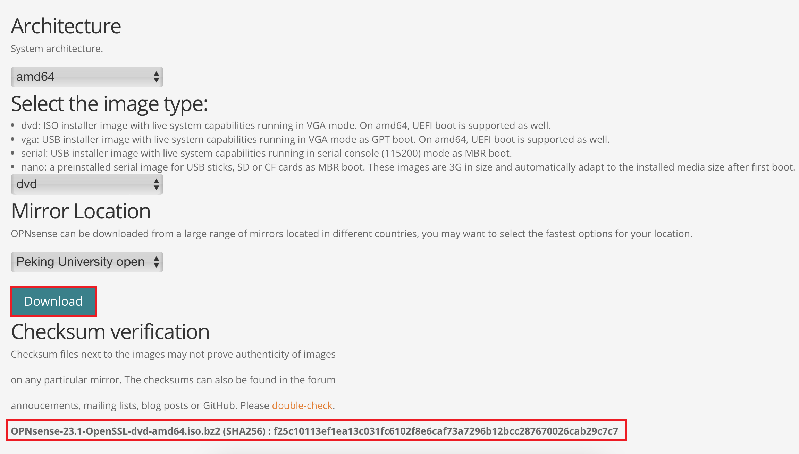

OPNsense 镜像默认为 `.bz2` 压缩格式，因此下载完成并校验文件信息后，需要将镜像的 ISO 文件解压出来。  

本文将使用物理机安装 OPNsense ，启动盘制作工具请参考系列文章 [Proxmox VE 折腾手记 # 启动盘制作工具](https://gitee.com/callmer/pve_toss_notes/blob/master/01.PVE%E7%B3%BB%E7%BB%9F%E5%AE%89%E8%A3%85.md#02%E5%90%AF%E5%8A%A8%E7%9B%98%E5%88%B6%E4%BD%9C%E5%B7%A5%E5%85%B7) 。

硬件资源要求可以参考官方文档 [Hardware sizing & setup](https://docs.opnsense.org/manual/hardware.html) 。  

官方建议硬件配置参数如下：  

|硬件|参数|
|--|--|
|CPU|`1.5 GHz multi core cpu`|
|RAM|`8 GB`|
|DISK|`120 GB SSD`|

因此在安装 OPNsense 之前，需准备以下内容：  

- 一台已经联网的 `前置路由器` 或 `光猫`
- OPNsense ISO 镜像文件
- 物理机安装时，需要制作 USB 启动盘
- 用于安装 OPNsense 的虚拟机或物理机

**额外说明：**  

1. 经过测试，一般情况下 `4` 核心 `4 GB` 内存足够使用，但若开启 `Suricata` 模块，内存建议不少于 `8 GB` 。  

2. OPNsense 至少需要 `4 GB` 硬盘空间，但若保留大量日志以及流量图表数据，硬盘建议不少于 `40 GB` 。  

3. OPNsense 支持 `Legacy / UEFI` 引导模式，但更建议使用 `UEFI` 模式。  

4. 关于 OPNsense 网口数量，除非将 OPNsense 作为旁路设备，通常情况下至少需要 `2` 个网口。  

    4.1. 虚拟机或物理机只有双网口时，通常情况下无需创建 `bridge` 接口，即网桥。  

    4.2. 对于双网口虚拟机，建议初始化阶段有 `3` 个网口，配置完成后可移除不必要的网口。  

    4.3. 对于双网口物理机，建议准备一个千兆 USB 网卡，配置完成后可移除 USB 网卡。  

    4.4. 第 `3` 网口为可选项，仅用于保证 OPNsense 在 PPPoE 拨号场景下网口分配顺序与物理顺序保持一致。  

## 1. OPNsense 系统安装

由于机型不同，BIOS 的设置也不同，所以本文不演示具体如何将机器设置成从 U 盘启动。  

### 1.1.设备引导

使用 `Ventoy` 进行设备引导后，出现如下画面，选择 OPNsense 的 ISO 镜像文件 ：  

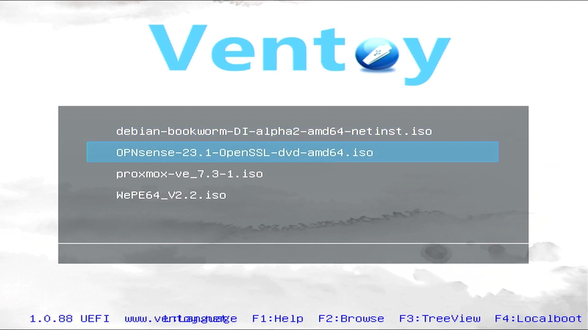

### 1.2.配置导入

进入引导跑码阶段，系统会出现提示，信息如下：  

> Press any key to start the configuration importer: ...  

表示系统正在等待用户决定是否需要导入配置，一般情况下 **忽略** 即可。  

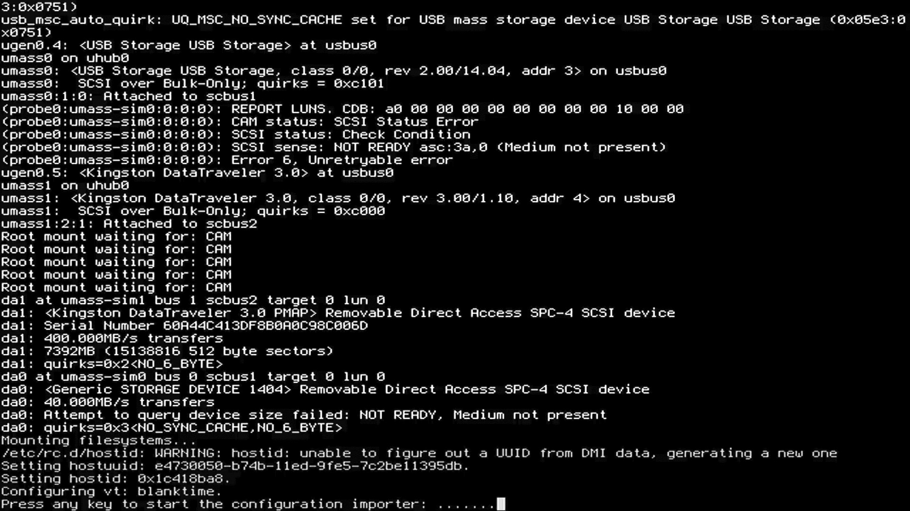

### 1.3.分配网口

系统将继续跑码，并再次出现提示，信息如下：  

> Press any key to start the manual interface assignment: 5  

表示系统正在等待用户决定是否 **手动** 分配网口，有 `5` 秒倒计时。  

此时需要在倒计时结束之前，按下键盘 **任意** 按键（例如 `空格键` 或 `回车键` ）进入网口分配流程。  

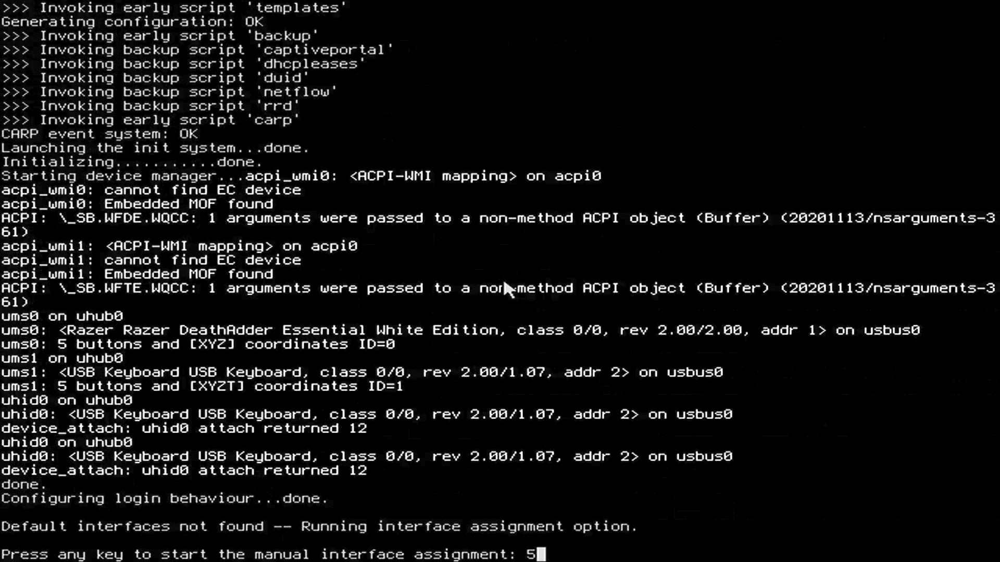

系统提示是否配置 `LAGGs` ，输入 `N` 并回车：  

> Do you want to configure LAGGs now?  [y/N]: N  

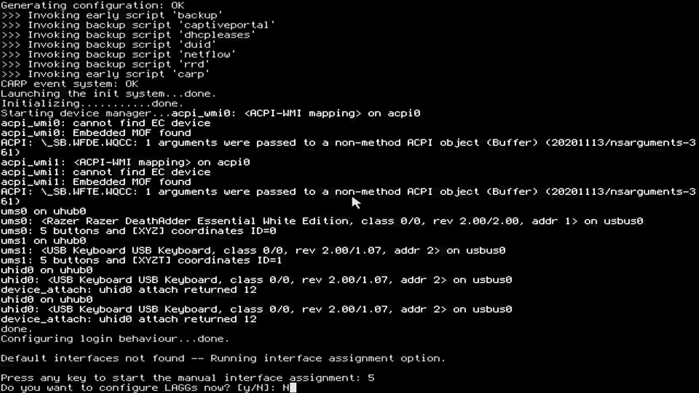

系统提示是否配置 `VLANs` ，输入 `N` 并回车：  

> Do you want to configure VLANs now?  [y/N]: N  

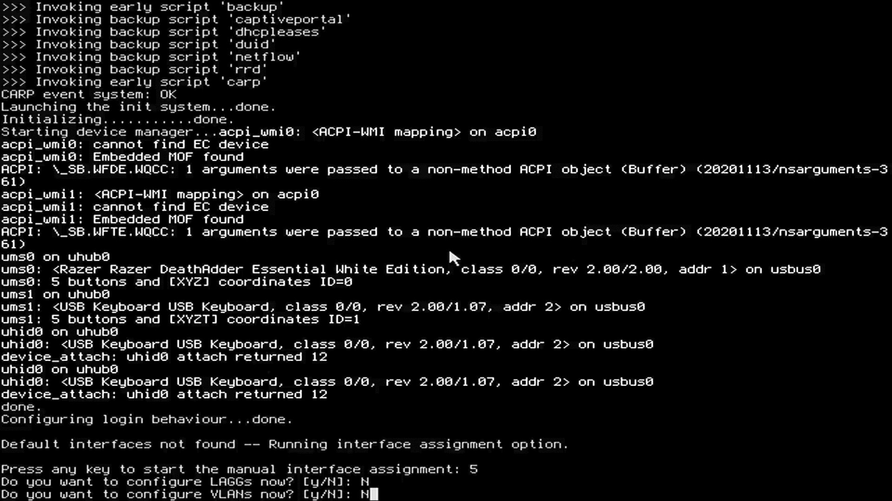

系统会显示出网口列表，并提示信息：  

> Enter the WAN interface name or 'a' for auto-detection:  

表示系统等待用户输入 `WAN` 对应的网口名称，或输入 `a` 进行自动探测。  

此时，需要根据 `Valid interface are` 列表中的信息，选择 `WAN` 对应的网口。  

**注意：不同硬件类型的网卡，此处显示的网口名称会有所不同，请注意区分。**  

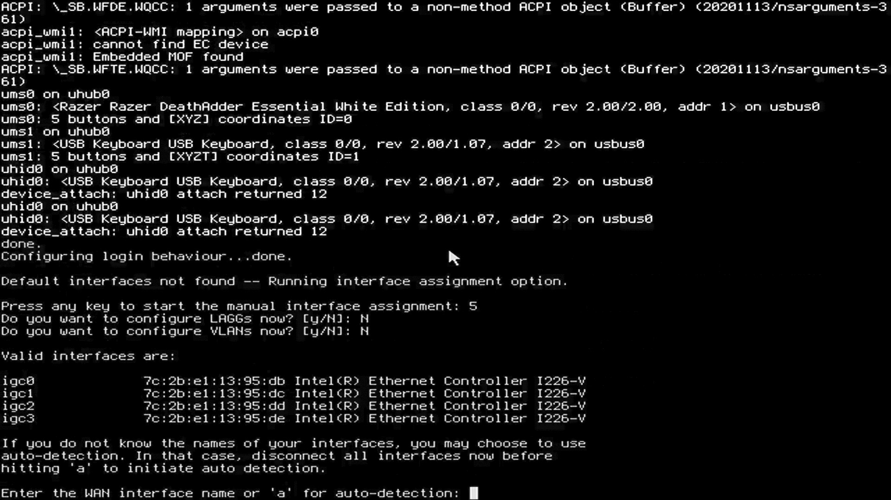

本文以 **第一个** 网口 `igc0` 分配为 `WAN` 口进行演示：  

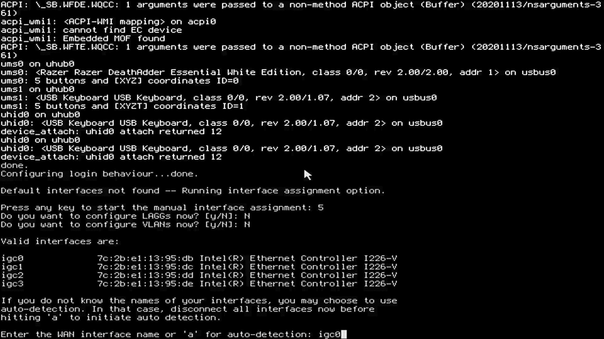

`WAN` 口分配完成后，系统会提示如下信息：  

> Enter the LAN interface name or 'a' for auto-detection  
> NOTE: this enables full Firewalling/NAT mode.  
> (or nothing if finished):  

表示系统等待用户输入 `LAN` 对应的网口名称，或输入 `a` 进行自动探测。  

而且一旦分配了 `LAN` ，OPNsense 将默认激活 `防火墙` 和 `NAT` 相关功能。  

如果用户不想指定任何 `LAN` ，留空即可。  

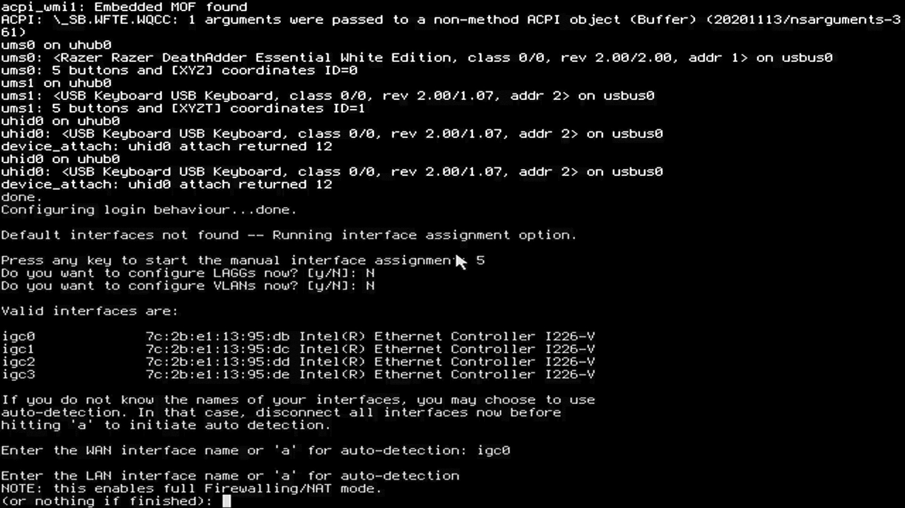

为了后续 OPNsense 网口顺序与物理网口保持一致，请选则 **最后一个** 网口。  

当前最后一个网口为 `igc3` ，将其分配为 `LAN` 口：  

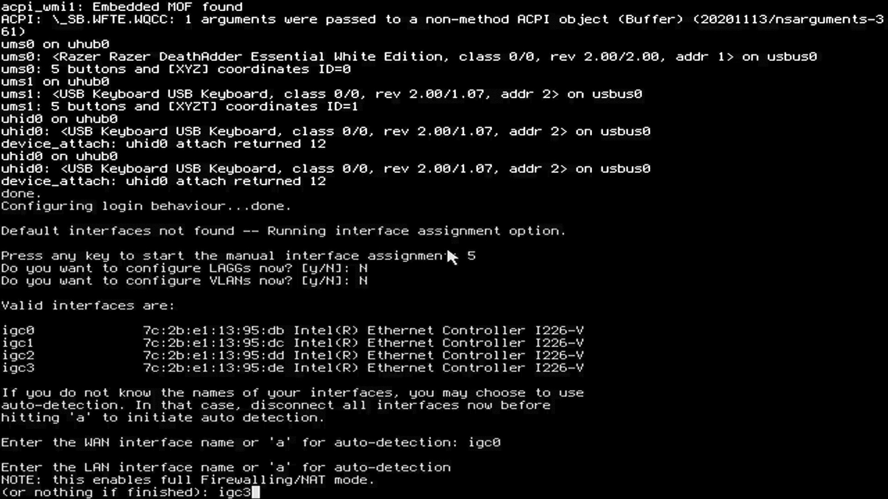

`LAN` 口分配完成后，系统会提示如下信息：  

> Enter the Optional interface 1 name or 'a' for auto-detection  
> (or nothing if finished):  

表示系统等待用户输入 `OPT1` （可选网口）对应的网口名称，或输入 `a` 进行自动探测。  

如果用户不想指定任何 `OPT1` ，留空即可。  

本文后续将会创建内部网桥，因此不对其分配网口，直接按 `回车键` 结束网口分配流程。  

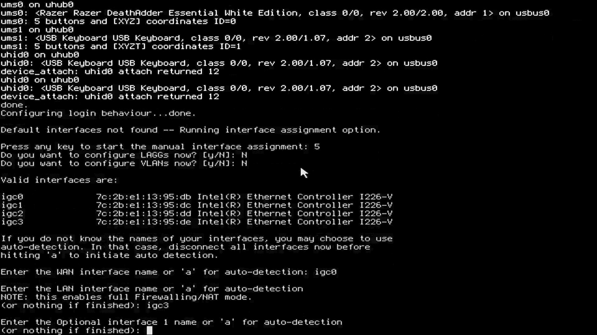

系统展示当前网口分配结果，并询问是否执行，输入 `y` 并回车：  

> Do you want to proceed?  [y/N]: y  

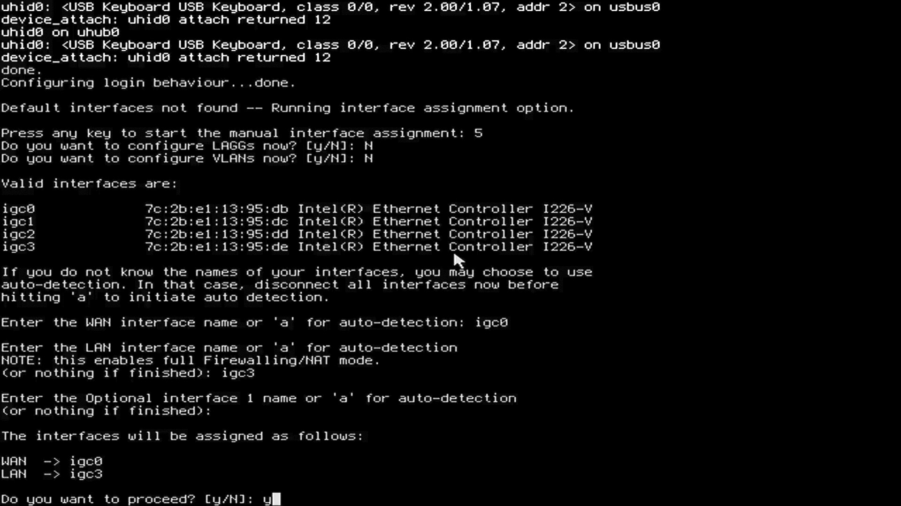

### 1.4.登录安装账户

系统将继续跑码，并停留在如图所示处。  

与其他路由器系统不同，OPNsense 提供了一个免安装的 `live mode` 方便大家体验。  

处于 `live mode` 下的 OPNsense 可通过地址 `192.168.1.1` 进行访问。  

但所有对 OPNsense 的参数修改，将在系统重启后丢失。  

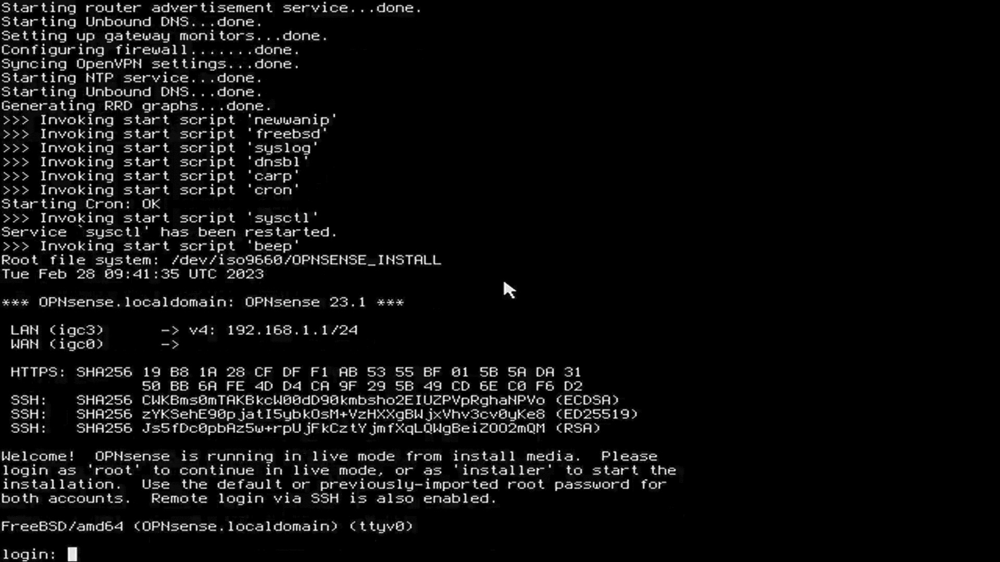

此时，使用账户 `installer` 和默认密码 `opnsense` 进行登录，进入系统安装流程。  

与 Linux 系统一样，输入密码时不会有任何提示符出现。  

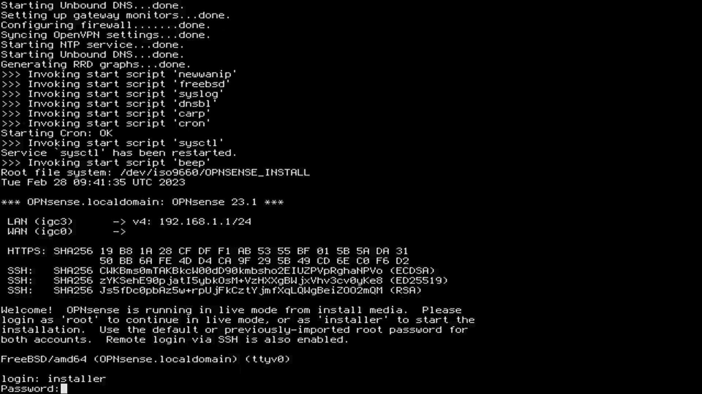

### 1.5.选择键盘键位

一般保持默认的 `US` 键盘键位即可，按键盘 `回车键` 继续。  

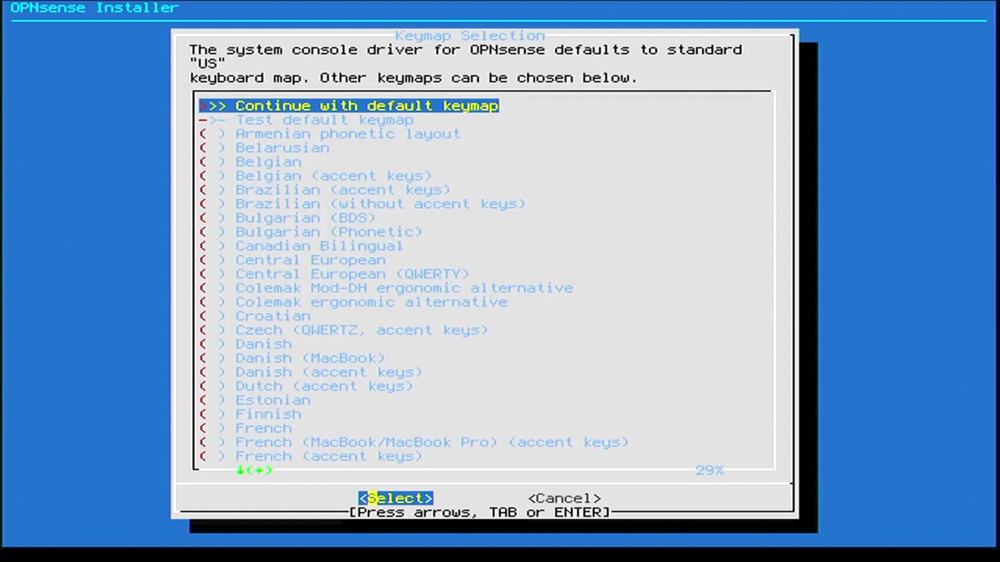

### 1.6.配置文件系统

默认情况下 OPNsense 将使用 `UFS` 文件系统，但本文以 `ZFS` 进行演示。  

因为 OPNsense 底层为 FreeBSD ，已对 `ZFS` 文件系统提供良好支持。  

按键盘 `方向键` 选择 `Install (ZFS)` ，按 `回车键` 继续。  

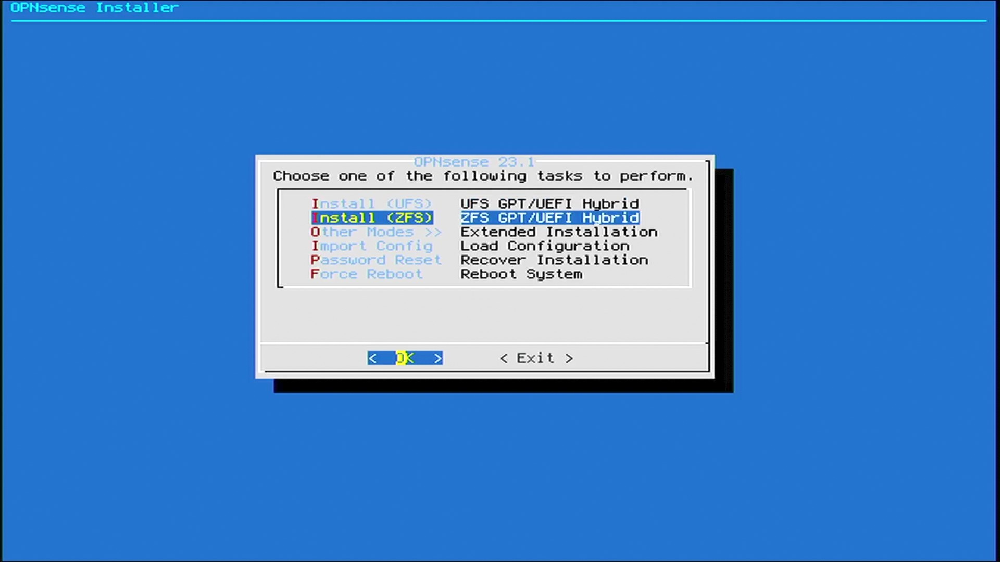

`ZFS` 提供了多种冗余模式，不同模式之间的区别可参考 TrueNAS 相关文档，简单来说区别如下：

> stripe: single disk stripe pool  
> mirror: mirror pool (similar to raid-1, ≥ 2 disks, 1:1 redundancy)  
> raidz1 pool (similar to raid-5, ≥ 3 disks, 1 disk redundancy)  
> raidz2 pool (similar to raid-6, ≥ 4 disks, 2 disks redundancy)  
> raidz3 pool (similar to raid-7, ≥ 5 disks, 3 disks redundancy)  

由于此时只有一块硬盘，因此选择条带模式 `stripe` 。  

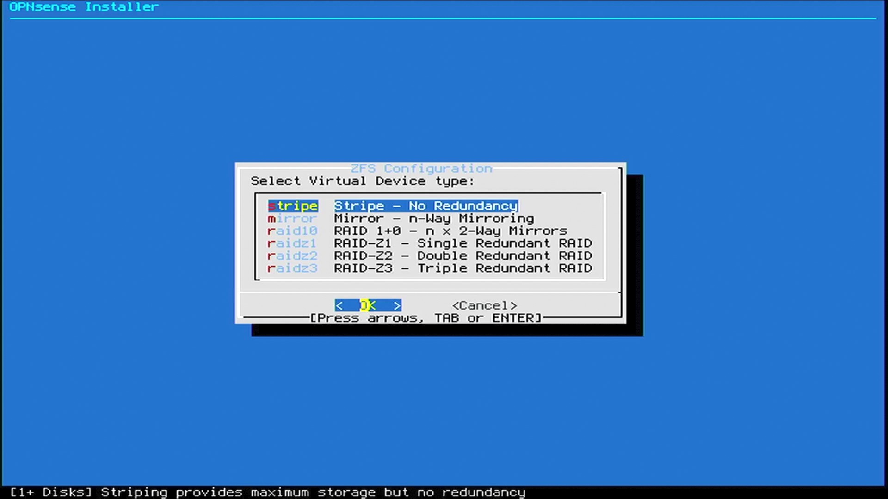

选择安装目标硬盘，按键盘 `方向键` 来选择，按 `空格键` 选中，按 `回车键` 继续。  

被选中的硬盘前面将出现 `[*]` 标记，这里以 `NVMe` 固态硬盘进行演示。  

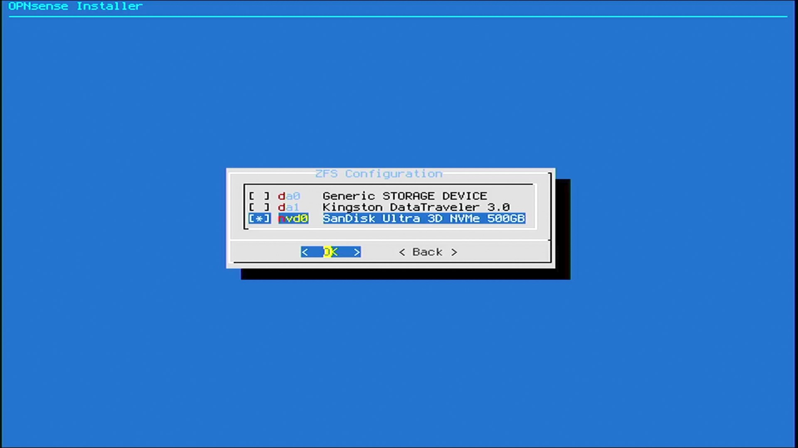

系统提示该操作会 **格式化** 硬盘，按键盘 `方向键` 选择 `YES` ，按 `回车键` 继续。  

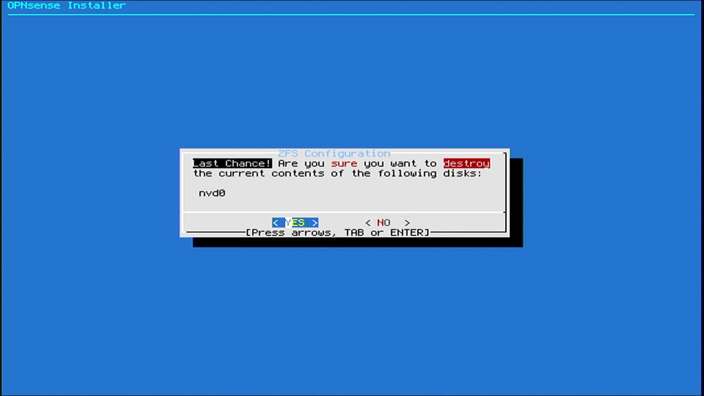

### 1.7.安装进度

OPNsense 安装正式开始，可以看到当前执行步骤以及进度。  

### 1.8.安装完成

按键盘 `方向键` 选择 `Complete Install` ，按 `回车键` 继续。  

此时系统将重新启动，对于物理机安装时，可移除引导 U 盘。  

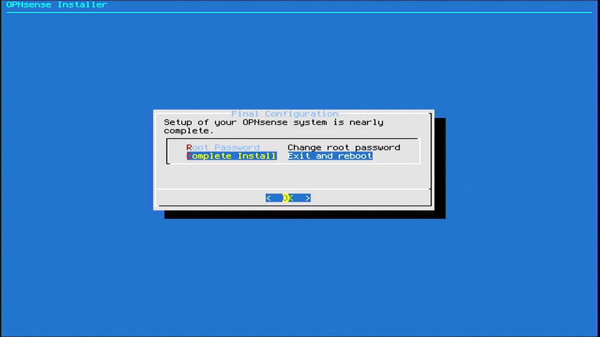

至此 OPNsense 安装步骤全部完成。  

