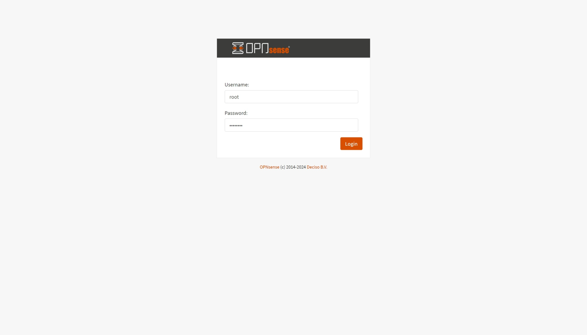
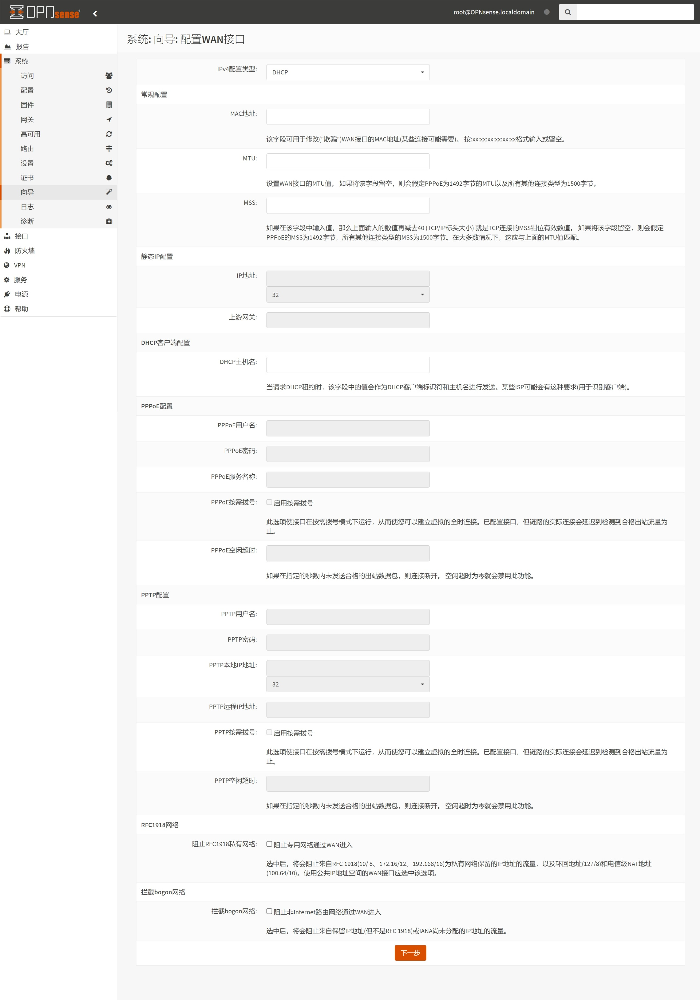
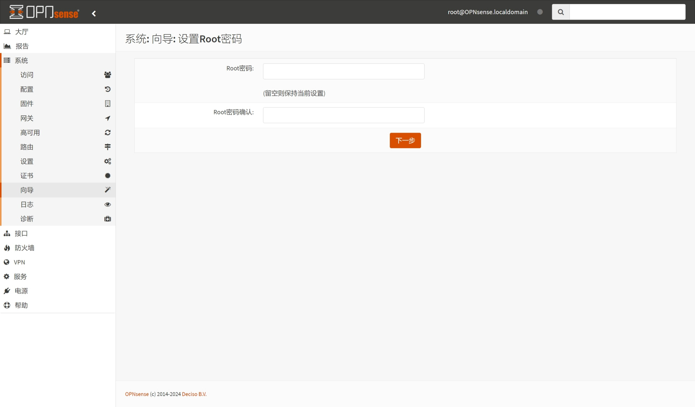
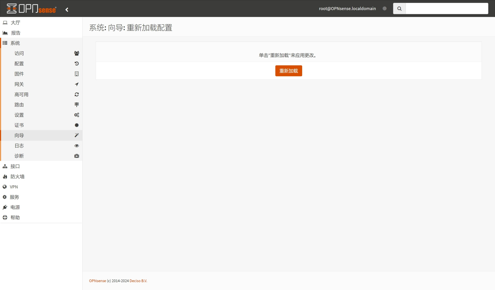
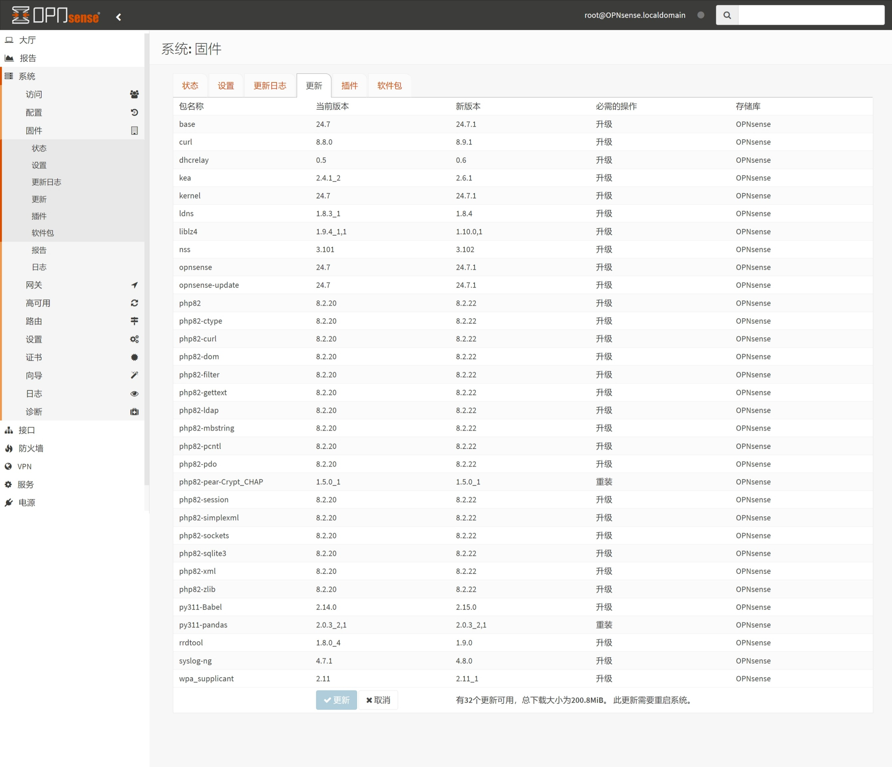
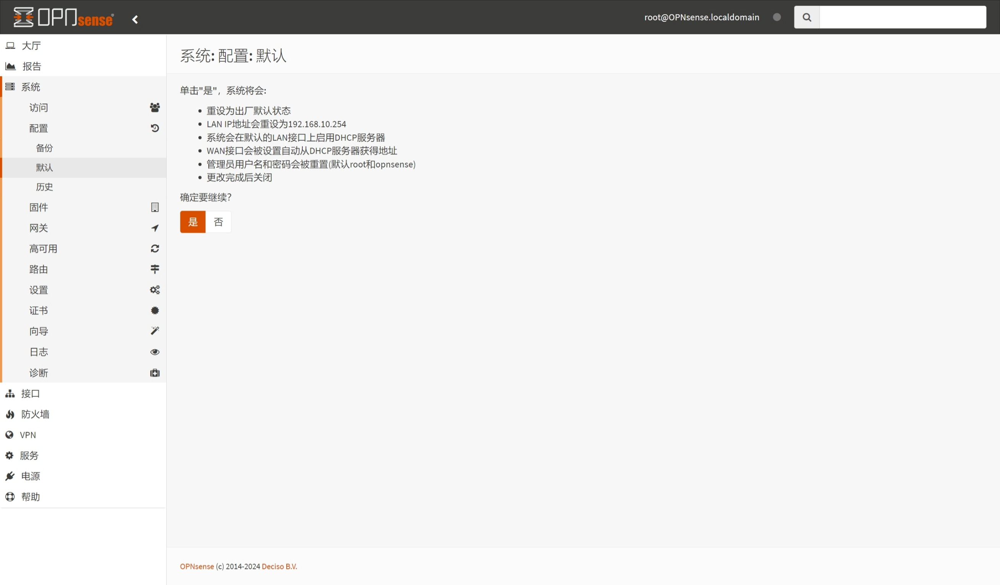
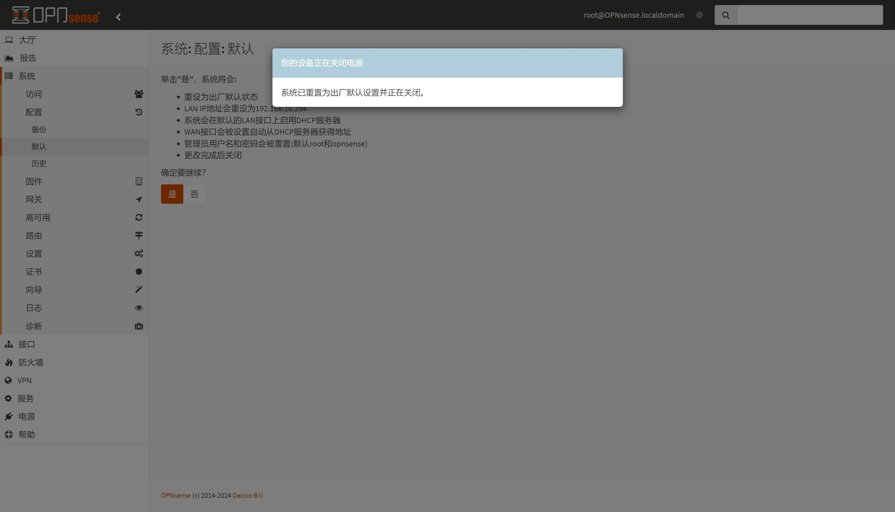

## 1.配置向导

在上一篇文章 [01.OPNsense安装](./01.OPNsense安装.md) 中，已经安装好了 OPNsense 。  

由于 OPNsense 系统更新较快，尤其是安全更新，平均 `2` 周左右就会收到一次小更新。  

因此，多数情况下使用 OPNsense ISO 镜像安装的系统并非为最新版本。  

**建议在 OPNsense 安装完成后，优先对系统进行一次跟新，然后再恢复一次出厂设置。**  

默认情况下，OPNsense 的 IPv4 地址为 `192.168.1.1` 。  

将电脑网络设置为与 `192.168.1.0/24` 同网段地址，例如 `192.168.1.233/24` 。  

用网线将电脑网口与 OPNsense 最后一个网口连接，并访问 `https://192.168.1.1` 。  

OPNsense 默认账户为 `root` ，初始化密码为 `opnsense` ，使用该密码进行登录。  

稍等片刻，系统将自动跳转到配置向导，点击 `Next` 。  

`Language` 修改为 `Chinese (Simplified)` ， `Primary DNS Server` 填入国内常用 DNS 服务器 `119.29.29.29` 。  

推荐 **取消** 勾选 `Override DNS` ，并点击 `Next` 。  

时区选项，`Timezone` 选择 `Asia/Shanghai` ，并点击 `Next` 。  

`WAN` 配置步骤，保持 `IPv4配置类型` 为 `DHCP` 不变。  

**取消勾选** 页面底部的 `阻止RFC1918私有网络` 和 `拦截bogon网络` 选项，并点击 `下一步` 。  

`LAN` 配置步骤需要注意，OPNsense 默认 `LAN IP地址` 为 `192.168.1.1` 。  

如果该地址与 `前置路由器` 或 `光猫` IPv4 地址冲突，需要手动调整。  

手动调整 `LAN IP地址` 后，需要同步手动调整电脑网卡的静态 IPv4 地址。  

暂无需修改密码，点击 `下一步` 。  

系统需要重新加载配置，点击 `重新加载` 。  

## 2.更新系统

打开左侧导航 `系统 - 固件 - 设置` 页面。  

`镜像` 设置为 `(other)` ，此时系统会显示额外输入框，允许用户自定义系统镜像。  

在对话框中输入北京大学 OPNsense 镜像地址 `https://mirrors.pku.edu.cn/opnsense` ，并点击 `保存` 。  

**注意：镜像地址链接结尾处，不要有多余的符号 `/` 。**  

点击 `状态` 选项卡，可以看到当前系统镜像已被设置为北京大学镜像站地址，点击 `检查升级` 。  

系统会自动跳转到 `更新` 选项卡，并从镜像站同步数据。  

当系统检测到更新时，会弹出近期更新的 `Changelog` ，并显示待更新软件包列表。  

点击页面底部的 `更新` ，系统在更新完成后自动重启。  

## 3.恢复出厂设置

使用默认账户及密码重新登录 OPNsense ，打开左侧导航 `系统 - 固件 - 状态` 页面，检查更新后状态。  

出于以下目的 **建议** 执行一次恢复出厂设置操作：

- 当前 OPNsense 为 `DHCP` 模式联网，需要修改为 `PPPoE` 模式
- 移除 OPNsense 配置文件中 “过时” 配置项

打开左侧导航 `系统 - 配置 - 默认` 页面，点击 `是` ，即可恢复出厂设置。  

**额外说明：**  

1. 恢复出厂设置后，OPNsense 不会自动重启，需要手动启动。  

2. 需要在系统引导过程中，重新指定 `WAN / LAN` 对应的网口名称。  

3. 系统启动完成后，将再次使用 `配置向导` 对系统进行初始化配置。  

