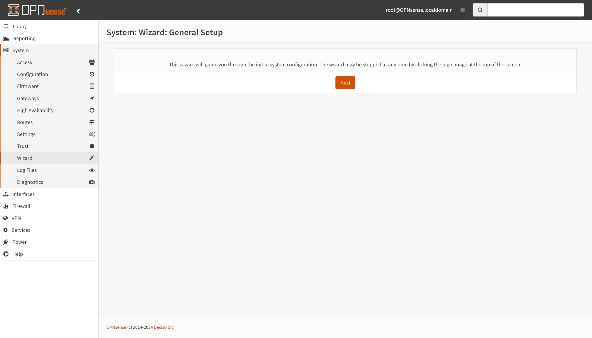
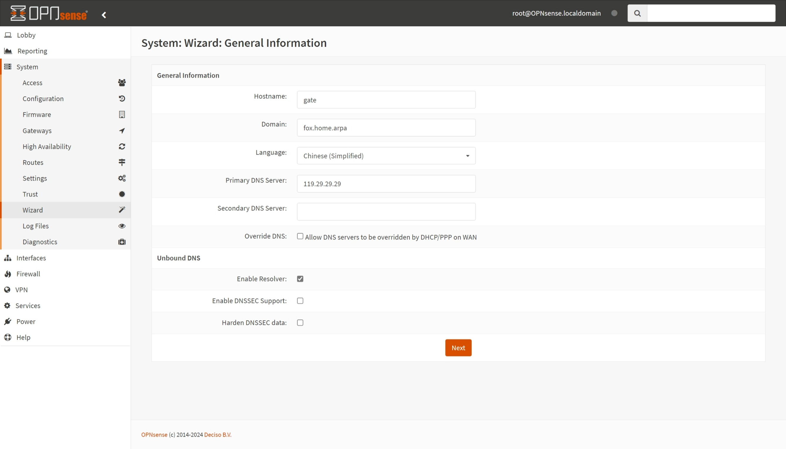
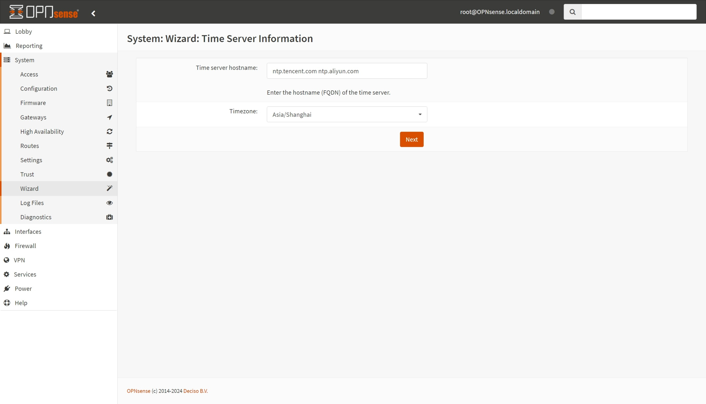

## 1.系统初始化

在上一篇文章 [02.首次系统更新](./02.首次系统更新.md) 中，更新了 OPNsense 并恢复了出厂设置，现在开始系统初始化操作。  

OPNsense 默认账户为 `root` ，初始化密码为 `opnsense` ，使用该密码进行登录。  

### 1.1. General Setup

稍等片刻，系统将自动跳转到配置向导，点击 `Next` 。  

### 1.2. General Information

`General Information` 中有以下内容需要调整：  

|参数|值|说明|
|--|--|--|
|Hostname|`gate`|系统主机名，建议用小写英文字母填写|
|Domain|`fox.home.arpa`|系统本地域名|
|Language|`Chinese (Simplified)`|系统 WEB 界面语言，修改为简体中文|
|Primary DNS Server|`119.29.29.29`|系统 DNS，支持 IPv4 IPv6 DNS 地址|
|Override DNS|**取消勾选**|是否允许系统 DNS 被上游协议覆盖|

按需修改完成后，点击 `Next` 。  

### 1.3. Time Server Information

`Time Server Information` 中有以下内容需要调整：  

|参数|值|说明|
|--|--|--|
|Time server hostname|`ntp.aliyun.com ntp.tencent.com cn.pool.ntp.org`|系统 NTP 服务器地址，用空格隔开|
|Timezone|`Asia/Shanghai`|系统本地时区|

按需修改完成后，点击 `Next` 。  

### 1.4.配置 WAN 接口

本文将使用 OPNsense `PPPoE` 拨号并配置 IPv6 ，因此 `WAN` 接口设置如下。  

|参数|值|说明|
|--|--|--|
|IPv4 配置类型|`PPPoE`| IPv4 联网方式，选择 `PPPoE` |
|PPPoE 用户名|拨号账户|`PPPoE` 拨号账户|
|PPPoE 密码|拨号密码|`PPPoE` 拨号密码|
|阻止 RFC1918 私有网络|**勾选**|即使是非公网 IPv4 地址，也需勾选|
|拦截 bogon 网络|**勾选**|即使是非公网 IPv4 地址，也需勾选|

按需修改完成后，点击 `下一步` 。  

### 1.5.配置 LAN 接口

本文将使用 `172.16.1.0/24` 作为内网网段，因此 `LAN` 接口设置如下。  

|参数|值|说明|
|--|--|--|
|LAN IP 地址|`172.16.1.1`|系统 `LAN` IPv4 地址|
|子网掩码|`24`|即 `255.255.255.0`|

按需修改完成后，点击 `下一步` 。  

### 1.6.设置 Root 密码

为了保证 OPNsense 安全性，建议使用包含大小写英文字母以及特殊符号的强密码。  

密码设置完成后，点击 `下一步` 。  

### 1.7.重新加载配置

点击 `重新加载` 让配置生效。  

此时需要重启电脑网络，检查电脑是否获取了新的内网地址。  

尝试使用新地址 `https://172.16.1.1` 访问 OPNsense ，若无法访问，建议重启 OPNsense 。  

至此，OPNsense 初始化步骤完成。  

