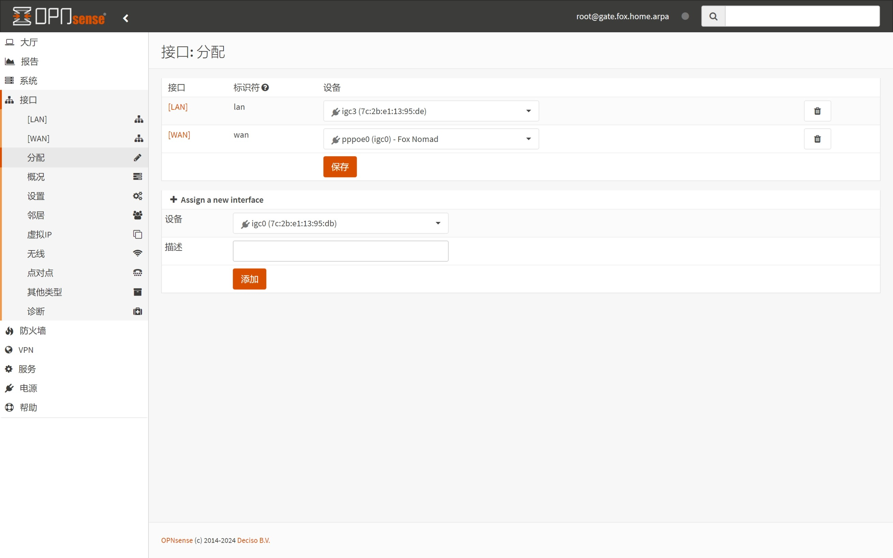
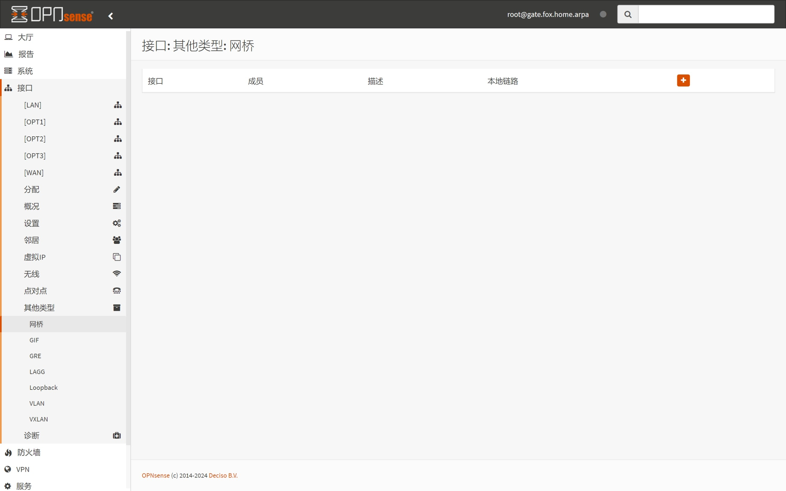
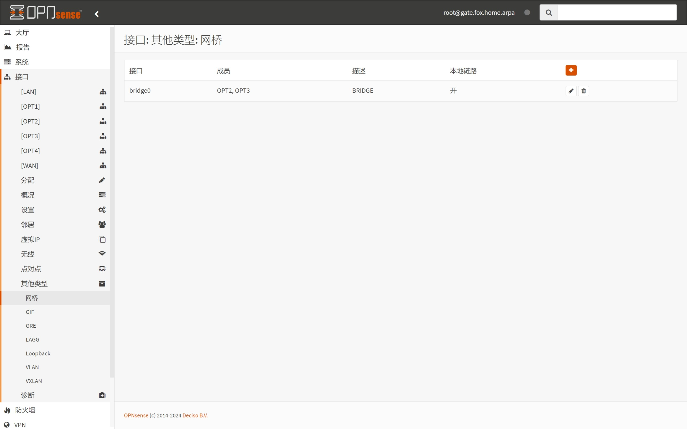
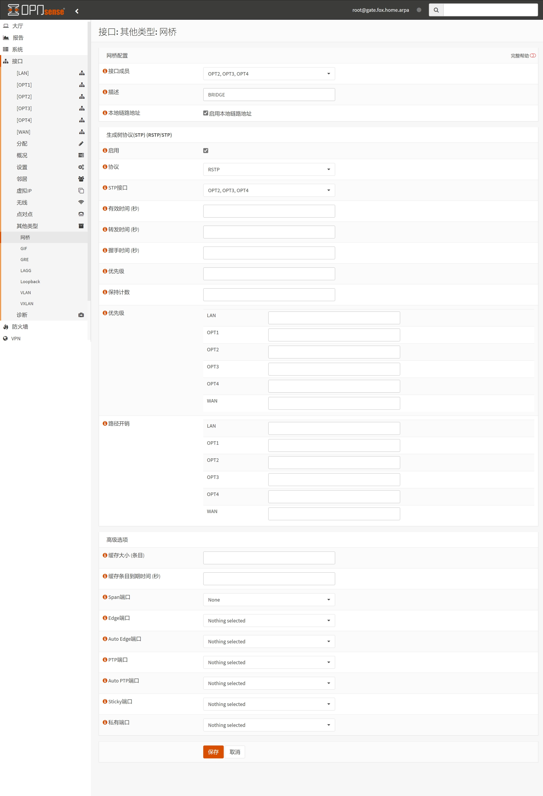
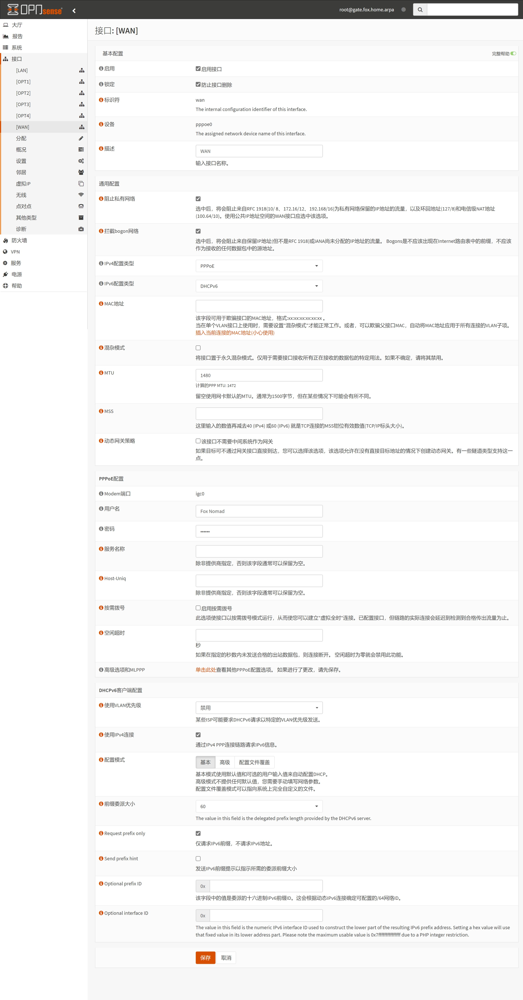

## 1.分配 OPT 接口

在上一篇文章 [03.系统初始化](./03.系统初始化.md) 中，已经初始化了 OPNsense ，现在需要进一步调整各网口。  

预计各网口调整完成后，OPNsense 接口与物理网口对应关系如下。  

|OPNsense 接口名称|网口名称|物理机网口编号|
|--|--|--|
|`WAN`|`pppoe0`|`ETH0`|
|`LAN`|`bridge0`|`ETH1` 、 `ETH2` 、 `ETH3`|
|`OPT1`|`igc0`|`ETH0`|
|`OPT2`|`igc1`|`ETH1`|
|`OPT3`|`igc2`|`ETH2`|
|`OPT4`|`igc3`|`ETH3`|

登录 OPNsense ，打开左侧导航 `接口 - 分配` 页面，查看当前网口分配状态。  

点击 `添加接口` 右侧 ` + ` 按钮，可将列表中当前网口添加为 `OPT` 接口。  

重复该操作，直至所有剩余网口全部添加，此时 `OPT` 接口顺序将与物理网口顺序保持一致。  

添加完成后，点击页面右侧 `保存` 。  

## 2.设置 OPT1 接口

因为 `OPT1` 对应的物理网口实际上为 `PPPoE` 拨号网口，因此该网口设置项与其他 `OPT` 接口略有不同。  

打开左侧导航 `接口 - OPT1` 页面， `OPT1` 接口设置如下。  

|配置分组|参数|值|说明|
|--|--|--|--|
|基本配置|`启用`|勾选|启用当前接口|
||`锁定`|勾选|防止当前接口被意外删除|
|通用配置|`拦截bogon网络`|**勾选**|在当前接口上拦截 Bogon 网络数据|

按需修改完成后，点击页面底部 `保存` 。  

## 3.设置其他 OPT 接口

对于其他 `OPT` 接口，将作为网桥成员使用，接口设置如下。  

|配置分组|参数|值|说明|
|--|--|--|--|
|基本配置|`启用`|勾选|启用当前接口|
||`锁定`|勾选|防止当前接口被意外删除|

按需修改完成后，点击页面底部 `保存` 。  

## 4.创建内部网桥

**注意：对于双网口的虚拟机或物理机，无需创建网桥。**  

打开左侧导航 `接口 - 其他类型 - 网桥` 页面，点击右侧 ` + ` 按钮。  

在创建网桥页面，通过勾选 `OPT` 接口来设置网桥 `接口成员` ，注意不要错误勾选了 `OPT1` 接口。  

推荐启用网桥的 `本地链路地址` 选项，按需修改完成后，点击页面底部 `保存` 。  

## 5.分配 LAN 接口

打开左侧导航 `接口 - 分配` 页面，再次查看当前网口分配状态。  

可以看到 `添加接口` 处出现了新的网桥接口 `bridge0` 。  

点击 `LAN` 右侧下拉列表，选择 `bridge0` 接口，点击页面右侧 `保存` 。  

此时页面会失去响应，因为当 `LAN` 设置为 `bridge0` 后，只有 `bridge0` 的 `接口成员` 才能访问 OPNsense 。  

因此，需要将电脑网口与 OPNsense 的第二或第三网口连接，才能恢复对 OPNsense 的访问。  

恢复后，回到 `接口 - 分配` 页面，此时 `LAN` 为 `bridge0` ，而之前作为 `LAN` 的 `igc3` 变成了待添加网口。  

## 6.分配 OPT4 接口

**注意：对于双网口物理机，如果该网卡为 USB 网卡，且后续会被移除时，无需执行本段内容。**  

点击 `添加接口` 右侧 ` + ` 按钮，将网口 `igc3` 添加为新的 `OPT` 接口。  

添加完成后，点击页面右侧 `保存` 。  

打开左侧导航 `接口 - OPT4` 页面， `OPT4` 接口设置如下。  

|配置分组|参数|值|说明|
|--|--|--|--|
|基本配置|`启用`|勾选|启用当前接口|
||`锁定`|勾选|防止当前接口被意外删除|

按需修改完成后，点击页面底部 `保存` 。  

## 7.调整内部网桥

打开左侧导航 `接口 - 其他类型 - 网桥` 页面，点击 `bridge0` 右侧 `铅笔(编辑)` 按钮。  

在 `接口成员` 中添加 `OPT4` ，如有必要可在 `描述` 中添加该网桥描述信息。  

按需修改完成后，点击页面底部 `保存` 。  

## 8.设置 WAN 接口

打开左侧导航 `接口 - WAN` 页面， `WAN` 接口设置如下。  

|配置分组|参数|值|说明|
|--|--|--|--|
|基本配置|`启用`|勾选|启用当前接口|
||`锁定`|勾选|防止当前接口被意外删除|
|通用配置|`阻止私有网络`|**勾选**|即使是非公网 IPv4 地址，也需勾选|
||`拦截bogon网络`|**勾选**|即使是非公网 IPv4 地址，也需勾选|
||`IPv4配置类型`|`PPPoE`| IPv4 联网方式|
||`IPv6配置类型`|`DHCPv6`| IPv6 获取方式|
||`MTU`|`1480`| MTU 默认值为 `1492` |
|PPPoE 配置|`用户名`|拨号账户|`PPPoE` 拨号账户|
||`密码`|拨号密码|`PPPoE` 拨号密码|
|DHCPv6 客户端配置|`配置模式`|`基本`|使用 `基本` 模式即可|
||`仅请求IPv6前缀`|**勾选**|从运营商侧获取 IPv6 前缀信息|
||`前缀委派大小`|`60`|不同运营商该参数可能不同|
||`使用IPv4连接`|**勾选**|通过 `PPPoE` 连接获取 IPv6 信息|

**额外说明：**  

1. `MTU` 参数默认值为 `1492` ，该参数与运营商相关，多数情况下无需修改（留空）。  

2. `前缀委派大小` 参数默认值为 `64` ，该参数与运营商相关，建议与运营商提供的参数保持一致。  

    2.1. 国内环境，该参数一般为 `56` 、 `60` 、 `64` 。  

    2.2. 不同的 `前缀委派大小` 将影响内网 IPv6 子网数量。  

    2.3. 国内运营商 `前缀委派大小` 参考如下，欢迎提交信息。  
    - 电信宽带： `56`  
    - 移动宽带： `60`  
    - 联通宽带： `60`  

按需修改完成后，点击页面底部 `保存` 并 `应用更改` 。  

## 9.设置 LAN 接口

打开左侧导航 `接口 - LAN` 页面， `LAN` 接口设置如下。  

|配置分组|参数|值|说明|
|--|--|--|--|
|基本配置|`启用`|勾选|启用当前接口|
||`锁定`|勾选|防止当前接口被意外删除|
|通用配置|`阻止私有网络`|**不勾选**|内网无需阻止私有网络|
||`拦截bogon网络`|**不勾选**|内网无需拦截 bogon 网络|
||`IPv4配置类型`|`静态IPv4`| IPv4 配置方式|
||`IPv6配置类型`|`跟踪接口`| IPv6 配置方式|
|静态 IPv4 配置|`IPv4地址`|`172.16.1.1`|OPNsense LAN IPv4 地址|
||`IPv4上游网关`|`自动检测`|`PPPoE` 将作为 IPv4 上游网关|
|跟踪 IPv6 接口|`IPv6接口`|`WAN`|使用 `WAN` 作为 IPv6 上游接口|
||`IPv6前缀ID`|`0`|一般情况下无需修改|
||`手动配置`|**勾选**|启用手动调整 `路由器通告` 能力|

按需修改完成后，点击页面底部 `保存` 并 `应用更改` 。  

接口设置完成，回到 `接口 - 分配` 页面，检查所有接口是否均为 **不可删除** 状态。  

## 10.设置系统可调参数

**注意：在未创建网桥时，无需执行本段内容。**  

打开左侧导航 `系统 - 设置 - 可调参数` 页面，找到以下参数，并点击右侧 `铅笔(编辑)` 按钮进行修改。  

|参数|值|说明|
|--|--|--|
|`net.link.bridge.pfil_bridge`|`1`|设置为 `1` 以启用网桥接口上的过滤|
|`net.link.bridge.pfil_member`|`0`|设置为 `0` 在入站和出站成员接口上禁用过滤。|

修改完成后，点击页面底部 `保存` 并 `应用更改` 。  

此处修改相当于修改了系统的 `sysctl` 配置文件，因此建议重启 OPNsense 让配置生效。  

至此，OPNsense 网络接口分配骤完成。  

