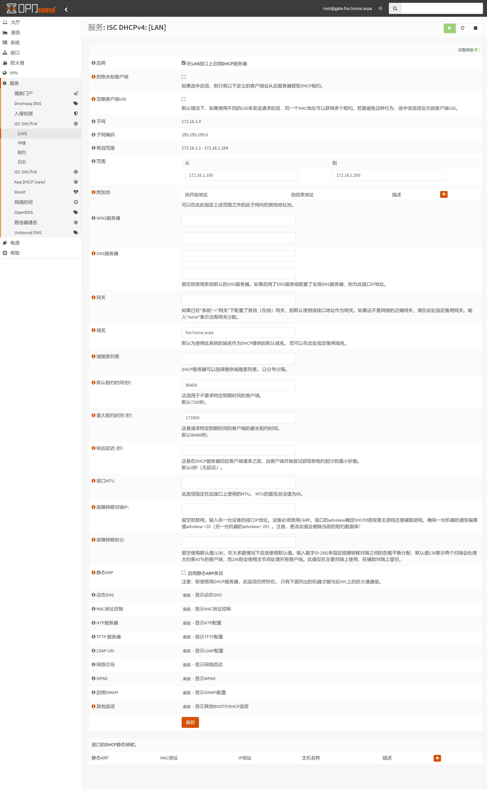
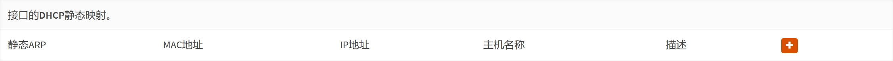

## 1.设置 DHCPv4 服务

在上一篇文章 [04.分配网络接口](./04.分配网络接口.md) 中，已经分配了网络接口，现在来调整 `DHCPv4` 服务。  

登录 OPNsense ，打开左侧导航 `服务 - DHCPv4 - [LAN]` 页面， `DHCPv4` 设置如下。  

|参数|值|说明|
|--|--|--|
|`启用`|勾选|启用 `DHCPv4` 服务|
|`范围`|`172.16.1.101 - 172.16.1.150`|地址池，支持 `50` 个内网设备，按需调整|
|`域名`|`fox.local`|系统本地域名|
|`默认租约时间 (秒)`|`86400`|`DHCPv4` IP 地址默认租约时长（1天）|
|`最大租约时间 (秒)`|`172800`|`DHCPv4` IP 地址最大租约时长（2天）|
|`修改时间格式`|勾选|使用本地时间显示 `DHCPv4` 租约|

修改完成后，点击页面底部 `保存` 。  

## 2.设置 IPv4 静态绑定

如需设置静态 IPv4 地址绑定，点击页面底部 `此接口的DHCP静态映射` 右侧 ` + ` 按钮。  

对于每个需要静态 IPv4 地址绑定的设备，需要填写以下内容。  

|参数|值|说明|
|--|--|--|
|`MAC地址`|`27:bc:e0:77:25:e1`|此为演示值，需根据设备 MAC 地址进行填写|
|`IP地址`|`172.16.1.10`|需要绑定的 IPv4 地址|
|`主机名称`|`fox_device1`|设备主机名|

**额外说明：**  

1. 对于 `IP地址` ，需要设置为与 `DHCPv4` 同网段地址。  

2. 建议 `IP地址` 不在 `DHCPv4` 的 `范围` 地址池中。  

3. 对于 `主机名称` ，不严格要求与设备真实主机名一致。  

4. 支持额外指定该设备的 `网关` 、 `DNS` 、 `租期` 等参数。  

按需修改完成后，点击页面底部 `保存` 并 `应用更改` 。  

## 3.查看 DHCPv4 租约

打开左侧导航 `服务 - DHCPv4 - 租约` 页面，即可查看当前所有 IPv4 租约状态。  

至此，OPNsense `DHCPv4` 设置骤完成。  

