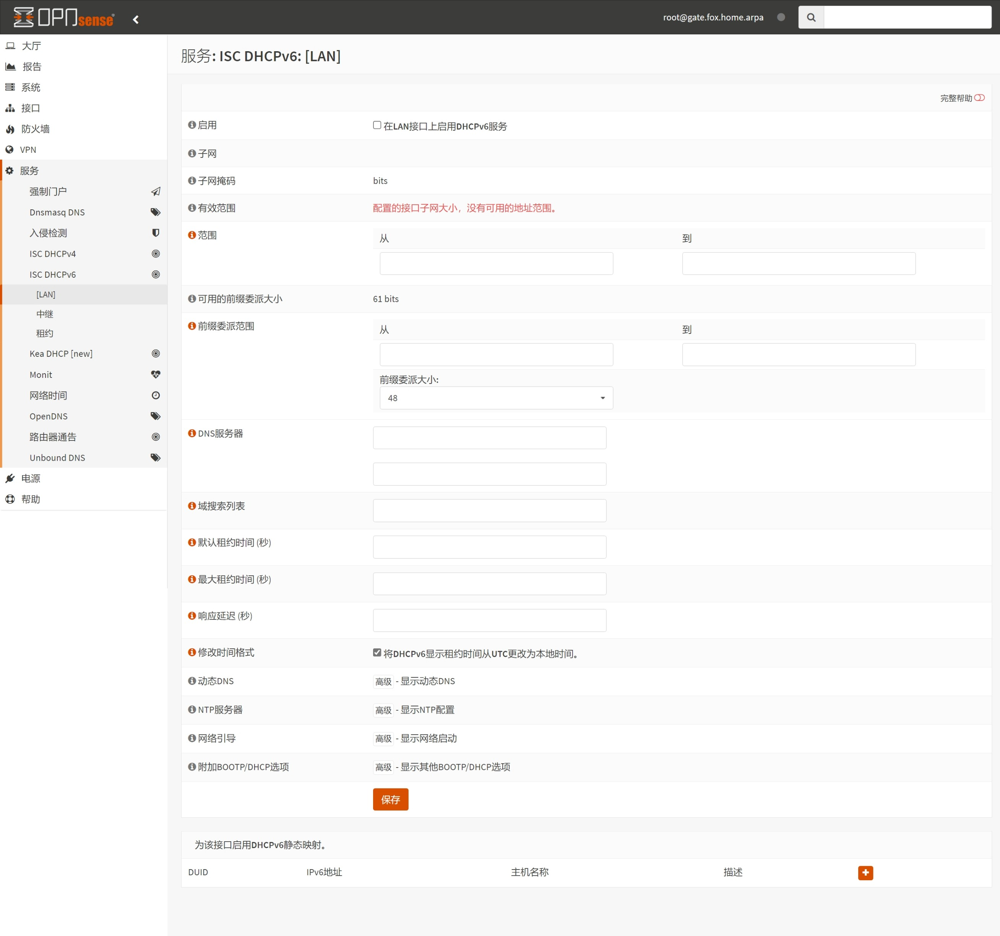
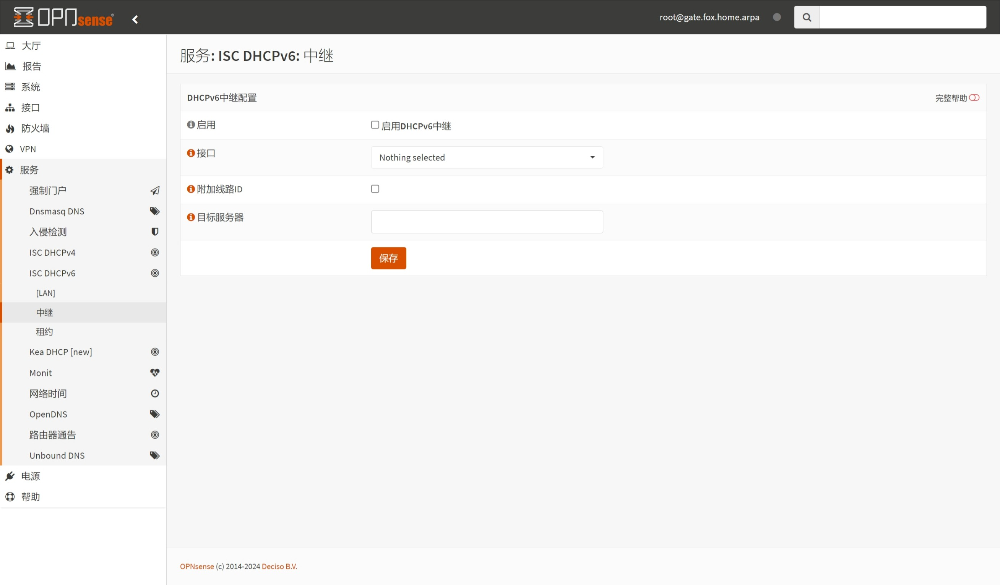

## 1.设置 DHCPv6 服务

在上一篇文章 [05.设置DHCPv4](./05.设置DHCPv4.md) 中，已经设置了 `ISC DHCPv4` 服务，现在来调整 `ISC DHCPv6` 服务。  

登录 OPNsense ，打开左侧导航 `服务 - ISC DHCPv6 - [LAN]` 页面。  

多数情况下无需使用 `ISC DHCPv6` 服务，内网设备将使用 `SLAAC` 来获取 IPv6 地址。  

|参数|值|说明|
|--|--|--|
|启用|**不勾选**|不启用 `ISC DHCPv6` 服务|
|修改时间格式|勾选|使用本地时间显示 IPv6 地址租约|

**额外说明：**  

1. `修改时间格式` 在 `ISC DHCPv6` 服务未启用时，不产生实际作用。  

修改完成后，点击页面底部 `保存` 。  

## 2.设置 DHCPv6 中继

同样，多数情况下无需使用 `ISC DHCPv6` 中继服务，但对 `光猫拨号` 场景可能有帮助。  

至此，OPNsense `ISC DHCPv6` 设置骤完成。  

