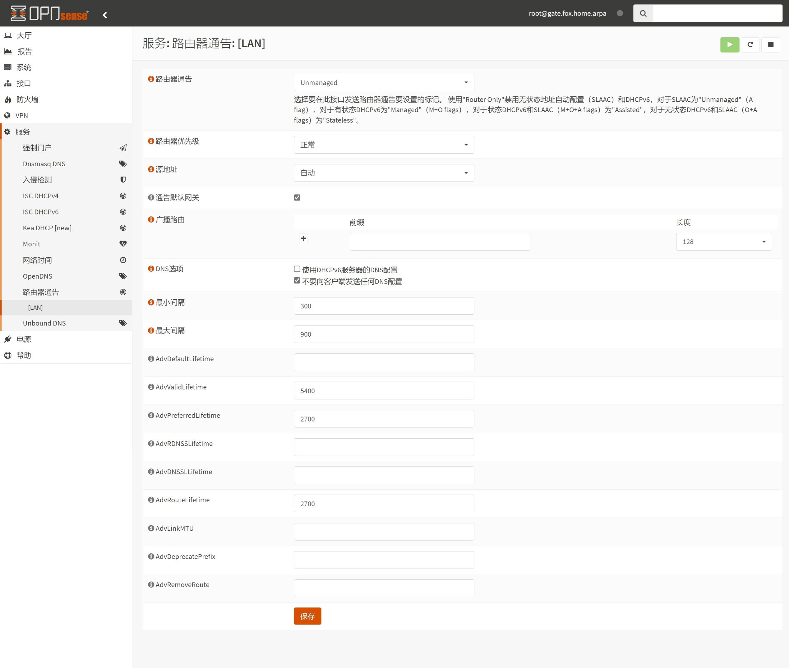

## 1.设置路由器通告

在上一篇文章 [06.设置DHCPv6](./06.设置DHCPv6.md) 中，已经设置了 `DHCPv6` 服务，现在来调整 `路由器通告` 。  

登录 OPNsense ，打开左侧导航 `服务 - 路由器通告 - [LAN]` 页面， `路由器通告` 设置如下。  

`高级` 选项需要手动打开，点击页面底部 `显示高级选项` 。  

|参数|值|说明|
|--|--|--|
|路由器通告|`Unmanaged`|该模式为无状态地址自动配置 `SLAAC` |
|路由器优先级|`正常`|即 `normal` 模式|
|源地址|`自动`|自动设置 `RA` 中源地址信息|
|通告默认网关|勾选|在 `RA` 中包含网关信息|
|DNS选项|`不要向客户端发送任何DNS配置`|在 `RA` 中移除 DNS 信息|
|最小间隔|`300`|单位为 `秒` ，通告最小时间间隔|
|最大间隔|`900`|单位为 `秒` ，通告最大时间间隔|
|AdvValidLifetime|`5400`|单位为 `秒` ，IPv6 地址最大有效期|
|AdvPreferredLifetime|`2700`|单位为 `秒` ，IPv6 地址建议有效期|
|AdvRouteLifetime|`2700`|单位为 `秒` ，IPv6 `RA` 有效期|

修改完成后，点击页面底部 `保存` 。  

至此，OPNsense `路由器通告` 设置骤完成。  

