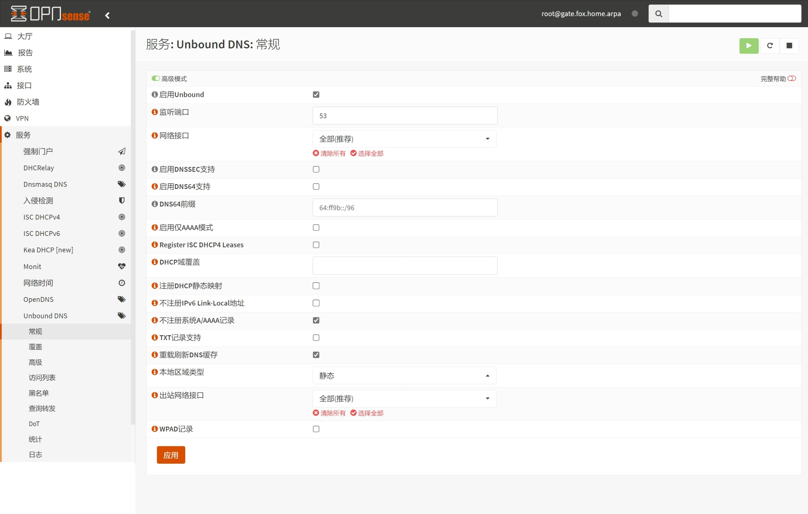
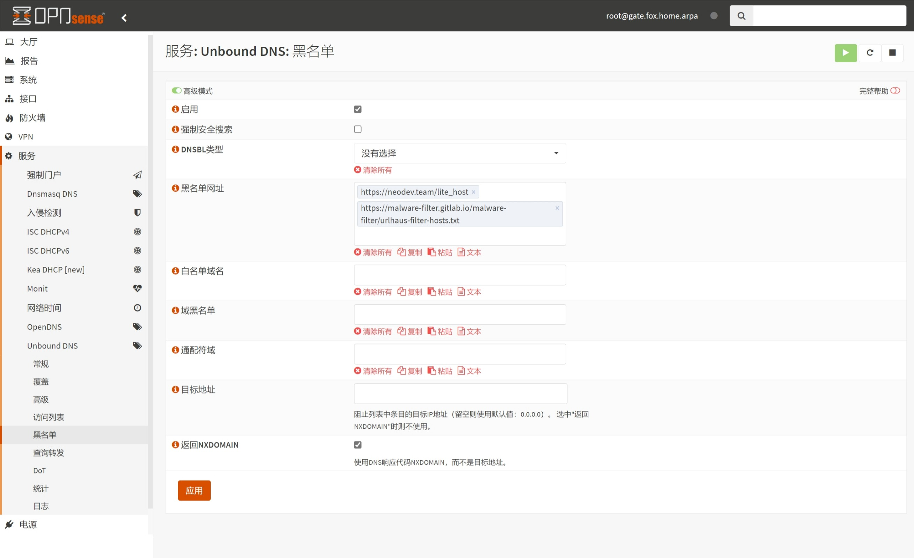
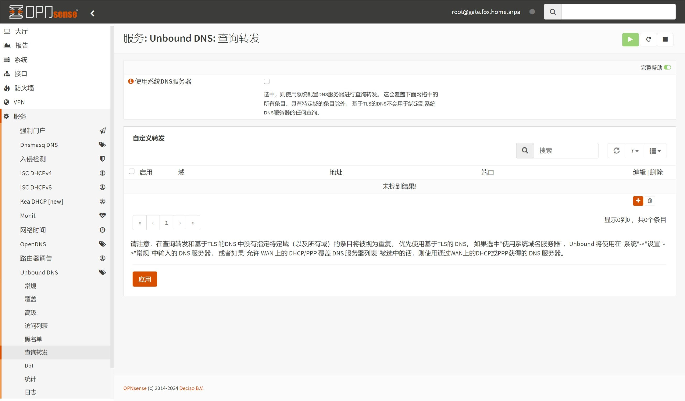
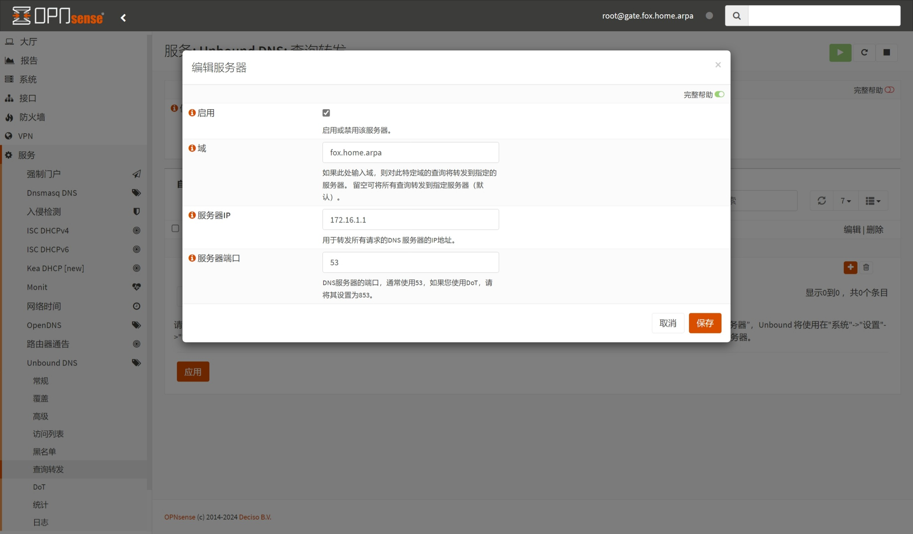
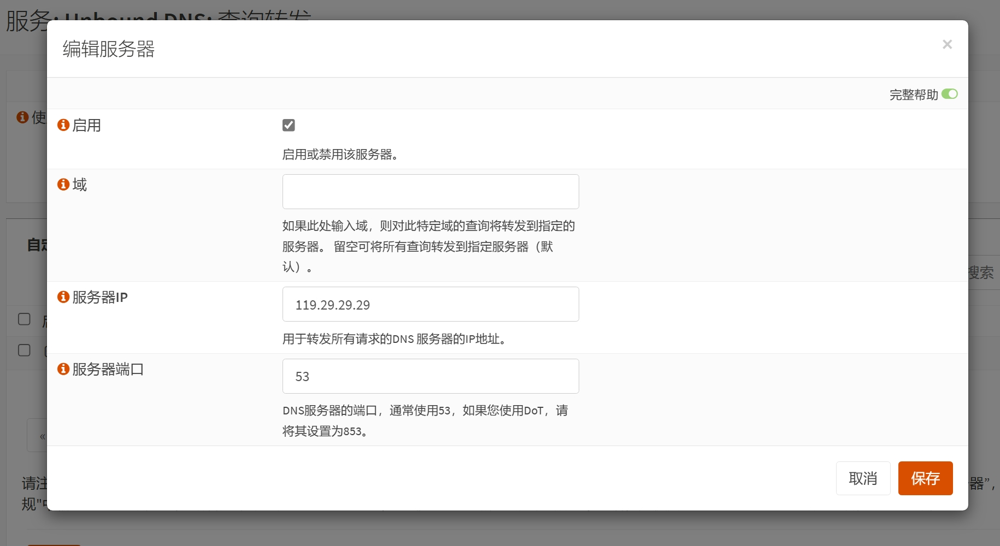
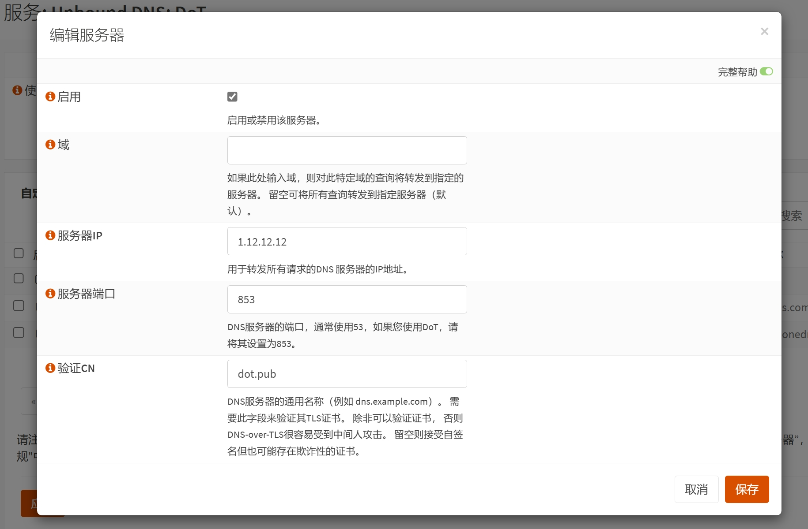
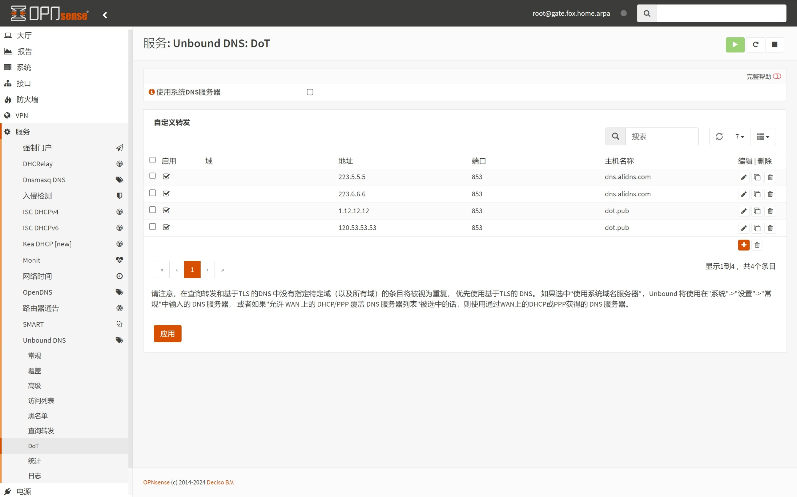

# 1.设置 Unbound DNS

在上一篇文章 [07.设置路由器通告](./07.设置路由器通告.md) 中，已经设置了 `路由器通告` ，现在来调整 `Unbound` 服务。  

`Unbound` 是 OPNsense 自带的 DNS 转发工具，且支持 DoT 、域名覆盖、DNS 黑名单等高级 DNS 功能。  

### 1.1.常规设置

登录 OPNsense ，打开左侧导航 `服务 - Unbound DNS - 常规` 页面， `Unbound` 服务 `常规` 设置如下。  

`高级` 选项需要手动打开，点击页面底部 `显示高级选项` 。  

|参数|值|说明|
|--|--|--|
|启用|勾选|启用 `Unbound` 服务|
|侦听端口|`53`|使用 `53` 端口对外提供服务|
|网络接口|`LAN`|监听的网络接口|
|DHCP静态映射|勾选|在 `Unbound` 中注册 DHCP 静态绑定|
|IPv6本地链路|**不勾选**|无需在 `Unbound` 中注册本地链路地址|
|System A/AAAA records|**勾选**|无需在 `Unbound` 中注册本机 IPv4 / IPv6 地址|
|DNS 缓存|勾选|在 `Unbound` 重新加载时刷新 DNS 缓存|
|本地区域类型|`transparent`|保持默认值即可|
|出站网络接口|`WAN`|设置向上游 DNS 发送请求时使用的网络接口|

**额外说明：**  

1. 如果上游 DNS 服务器支持 `DNSSEC` 协议，可勾选 `DNSSEC` 选项。  

按需修改完成后，点击页面底部 `保存` 并点击 `应用更改` 。  



### 1.2.高级设置

打开左侧导航 `服务 - Unbound DNS - 高级` 页面， `Unbound` 服务 `高级` 设置如下。  

|参数|值|说明|
|--|--|--|
|隐藏身份|勾选|启用时，`id.server` 和 `hostname.bind` 查询会被拒绝|
|隐藏版本|勾选|启用时，`version.server` 和 `version.bind` 查询会被拒绝|
|预取支持|勾选|在域名缓存过期之前尝试刷新缓存，对经常访问的域名较为友好|
|Strict QNAME Minimisation|勾选|向上游服务器发送最少的信息以增强隐私|
|Extended Statistics|勾选|在 `Unbound` 服务日志中输出扩展信息|
|Tag Queries and Replies|勾选|在 `Unbound` 服务日志中标记 DNS 查询、回复|
|Log local actions|勾选|在 `Unbound` 服务日志中记录 `local-zone` 操作|
|私有域|`fox.local`|标记私有域名，在被查询时允许返回私有网段地址|

**额外说明：**  

1. 如果上游 DNS 服务器支持 `DNSSEC` 协议，可勾选 `预取DNS密钥支持` 和 `Harden DNSSEC Data` 选项。  

2. 在 `私有域` 输入框中填写域名时，按下键盘 `回车键` 即可完成一次输入。  

3. 可在 `私有域` 输入框中填写多个域名，系统会自动识别。  

按需修改完成后，点击页面底部 `保存` 。  


### 1.3.黑名单设置

`Unbound` 的 `黑名单` 功能类似于 Adguard Home ，但黑名单文件使用的格式为 `域名列表` 。  

打开左侧导航 `服务 - Unbound DNS - 黑名单` 页面，并打开页面左上角的 `高级模式` 。  

设置 `黑名单` 时，会用到第三方的黑名单列表，具体参数设置如下。  

|参数|值|说明|
|--|--|--|
|启用|勾选|启用 `Unbound` 的黑名单功能|
|DNSBL 类型|`没有选择`|无需选择系统提供的黑名单列表|
|黑名单网址|(参见额外说明)|填入第三方黑名单列表|

**额外说明：**  

1. `DNSBL类型` 中提供了大量官方筛选出来的优秀黑名单，但其链接地址多在海外，容易下载失败。  

2. `DNSBL类型` 与 `黑名单网址` 中的黑名单列表可同时使用。  

3. 在有多个黑名单来源时， `Unbound` 会在一定程度上聚合黑名单中的列表地址。  

4. 黑名单中地址列表越多，越消耗主机的 CPU 、内存资源，同时会影响域名解析速度。  

5. 在 `黑名单网址` 输入框中填写链接地址时，按下键盘 `回车键` 即可完成一次输入。  

6. 可在 `黑名单网址` 输入框中填写多个链接地址，系统会自动识别。  

7. 当前常用的两个黑名单列表如下。  

```txt
## 列表名称
Malware Filter - 用于拦截病毒域名

## 黑名单链接
https://malware-filter.gitlab.io/malware-filter/urlhaus-filter-hosts.txt
```

```txt
## 列表名称
Anti AD - 用于拦截广告域名

## 黑名单链接
https://anti-ad.net/domains.txt
```

按需修改完成后，点击页面底部 `应用` 。  



### 1.4.查询转发设置

打开左侧导航 `服务 - Unbound DNS - Query Forwarding` 页面。  

`Query Forwarding` 即 DNS 查询转发，用于设置 `Unbound` 的上游 DNS 服务器。  

需要注意的是 `Use System Nameservers` 选项，若启用该选项，则产生以下效果：

- 在 `系统 - 设置 - 常规` 中设置的 DNS 服务器，将用于查询转发
- 将忽略 `Query Forwarding` 中设置的查询转发规则，除非该规则包含 `域名` 参数
- 所有 `DNS over TLS (DoT)` 服务器，将不再用于处理系统收到的 DNS 查询

因此，如非特殊需求或不使用 DoT ， **不推荐** 启用 `Use System Nameservers` 选项。  



设置 `Query Forwarding` 时，先设置私有域名查询转发规则，点击列表右侧 ` + ` 按钮，规则设置如下。  

|参数|值|说明|
|--|--|--|
|启用|勾选|启用本条查询转发规则|
|域|`fox.local`|设置为本地私有域名|
|服务器 IP|`172.16.1.1`|设置为 `LAN 接口` IPv4 地址|
|服务器端口|`53`|设置为 `Unbound` 的 `侦听端口` |

按需修改完成后，点击对话框右下角 `保存` 并点击页面底部 `应用` 。  



继续设置普通查询转发规则，同样点击列表右侧 ` + ` 按钮，规则设置如下。  

|参数|值|说明|
|--|--|--|
|启用|勾选|启用本条查询转发规则|
|域||无需填写域名参数|
|服务器 IP|(参见额外说明)|设置为知名公用 DNS 服务器|
|服务器端口|`53`|DNS 标准端口|

**额外说明：**  

1. `服务器 IP` 支持 IPv4 / IPv6 地址。  

2. 请选择知名公共 DNS 服务器。  

3. 如无特殊需求，请使用国内公共 DNS 服务器，以降低延迟。  

4. 建议不要在此处设置 DoT 服务器。  

5. 当前常用的公共 DNS 服务器列表如下。  

```txt
## DNSPod Public DNS

119.29.29.29
2402:4e00::
```

```txt
## 阿里云公共DNS

223.5.5.5
223.6.6.6
2400:3200::1
2400:3200:baba::1
```

按需修改完成后，点击对话框右下角 `保存` 并点击页面底部 `应用` 。  



可按需添加多个公共 DNS 服务器，添加完成后如图所示。  


### 1.5. DoT 设置

打开左侧导航 `服务 - Unbound DNS - DNS over TLS` 页面。  

`DNS over TLS` 即 DoT ，用于设置 `Unbound` 的上游 DoT 服务器。  

`Unbound` 设置 DoT 服务器后，会优先使用 DoT 服务器，遇到异常才会回退到 `Query Forwarding` 中的 DNS 服务器。  

点击列表右侧 ` + ` 按钮， DoT 服务器设置如下。  

|参数|值|说明|
|--|--|--|
|启用|勾选|启用本条 DoT 服务器|
|域||无需填写域名参数|
|服务器 IP|(参见额外说明)|设置为知名公用 DoT 服务器|
|服务器端口|`853`| DoT 标准端口|
|验证 CN|(参见额外说明)| DoT 域名地址验证|

**额外说明：**  

1. `服务器 IP` 支持 IPv4 / IPv6 地址。  

2. 请选择知名公共 DoT 服务器。  

3. 如无特殊需求，请使用国内公共 DoT 服务器，以降低延迟。  

4. 公共 DoT 服务器可能没有 IPv6 地址，但不影响 IPv6 地址解析。  

5. 当前常用的公共 DoT 服务器列表如下。  

```txt
## DNSPod Public DNS

域名 (CN) - dot.pub
1.12.12.12
120.53.53.53
```

```txt
## 阿里云公共DNS

域名 (CN) - dns.alidns.com
223.5.5.5
223.6.6.6
2400:3200::1
2400:3200:baba::1
```

按需修改完成后，点击对话框右下角 `保存` 并点击页面底部 `应用` 。  



可按需添加多个公共 DoT 服务器，添加完成后如图所示。  



至此，OPNsense `Unbound` 设置骤完成。  

