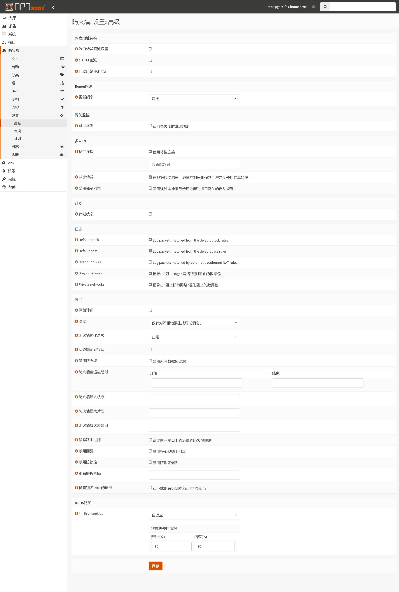
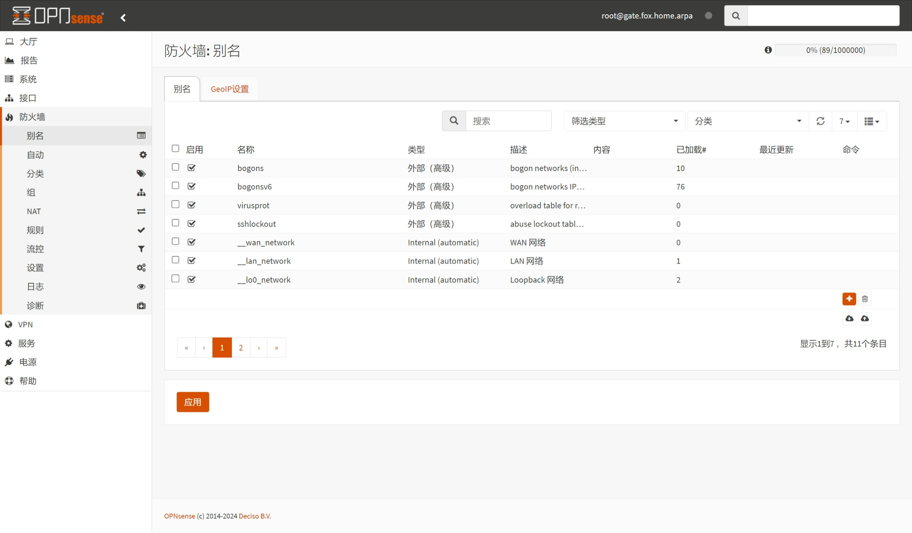
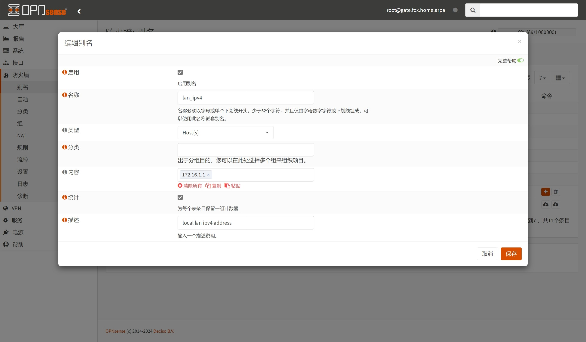
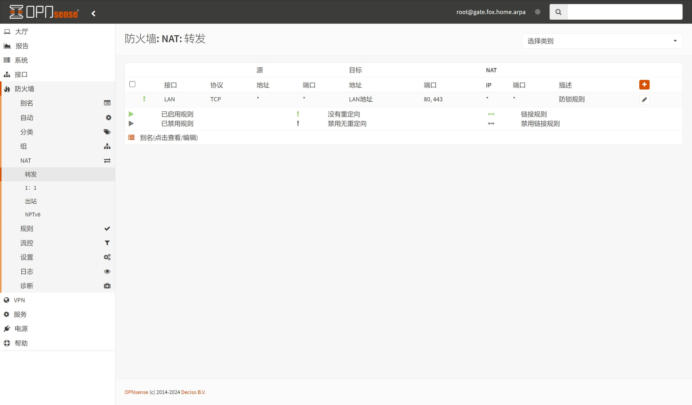

## 1.设置防火墙

在上一篇文章 [08.设置Unbound](./08.设置Unbound.md) 中，已经设置了 `Unbound` 服务，现在来调整防火墙。  

### 1.1.常规设置

登录 OPNsense ，打开左侧导航 `防火墙 - 设置 - 常规` 页面。  

OPNsense 防火墙 `常规设置` 中默认参数适用于大多数场景，如果遇到网络异常，可尝试修改本页配置项。  

### 1.2.高级设置

打开左侧导航 `防火墙 - 设置 - 高级` 页面，防火墙 `高级` 设置如下。  

|配置分组|参数|值|说明|
|--|--|--|--|
|Bogon 网络|更新频率|`每周`| `Bogon` 网络地址更新周期|
|DDoS防御|启用syncookies|`自适应`|开启自适应抗 DDoS 攻击|
||状态表使用情况|`开始(%) 60 - 结束(%) 30`|状态表用量阈值，用于自动激活抗 DDoS 攻击|

关于抗 DDoS 攻击设置，参考了 OPNsense 官方论坛：[[Q] How to set adaptive syncookies](https://forum.opnsense.org/index.php?topic=28579.0)  

按需修改完成后，点击页面底部 `保存` 。  

## 2.设置防火墙别名

防火墙中 `别名` 的概念与 RouterOS 防火墙的 `Address Lists` 比较接近，可用于简化防火墙配置。  

### 2.1. IPv4 别名

打开左侧导航 `防火墙 - 别名` 页面，防火墙默认 `别名` 如下。  

这里以添加别名 `lan_ipv4` （ `LAN 接口` 的 IPv4 地址）为演示，点击右下角 ` + ` 按钮，添加防火墙 `别名` 。  

|参数|值|说明|
|--|--|--|
|启用|勾选|启用该防火墙别名|
|名称|`lan_ipv4`|别名名称，建议使用英文字母填写|
|类型|`Host(s)`|设置别名类型|
|内容|`172.16.1.1`|支持单个或多个地址|
|统计数据|勾选|用于显示别名内包含的地址数量|
|描述|`local lan ipv4 address`|描述地址别名内容|

**额外说明：**  

1. 请不要将 IPv4 和 IPv6 地址同时混合填写到 `内容` 参数中。  

2. 在 `内容` 输入框中填写 IP 地址时，按下键盘 `回车键` 即可完成一次输入。  

3. 可在 `内容` 输入框中填写多个 IP 地址，系统会自动识别。  

按需修改完成后，点击对话框右下角 `保存` 并点击页面底部 `应用` 。  

若使用了内网 DNS 服务器，可创建别名 `lan_dnsv4` ，方便后续防火墙设置。  

### 2.2. IPv6 别名

**注意：建议在 OPNsense 正确获取运营商前缀后再设置 IPv6 别名。**  

OPNsense 支持使用 IPv6 公网前缀及目标主机的 IPv6 接口标识 **自动** 合成 IPv6 公网地址。  

其中目标主机的 IPv6 接口标识 （ `IPv6 Interface ID` ） 主要包含以下两类：  

1. EUI-64 地址，该地址通过目标主机的 MAC 地址生成，具有唯一性。  

2. 手动设置的，符合 IPv6 地址规范的，在当前子网中具有唯一性的接口标识。  

该功能，在用户需要获取目标主机当前正在使用的 IPv6 公网地址时，提供了便利。  

EUI-64 地址的生成过程如图所示，关于 IPv6 地址更多介绍，请查阅：[RFC4291 - IP Version 6 Addressing Architecture](https://www.rfc-editor.org/rfc/rfc4291)  

这里以添加别名 `lan_ipv6` （ `LAN 接口` 的 IPv6 GUA）为演示，首先需要获取 `LAN 接口` 的 IPv6 接口标识。  

打开左侧导航 `接口 - 概况` 页面，并点开列表中 `LAN 接口 (lan, bridge0)` 的详情信息。  

可以看到 `LAN 接口` 的 `IPv6 LLA` 和 `IPv6 GUA` 均包含 `5a9c:fcff:fe10:e160` 。  

而这 `5a9c:fcff:fe10:e160` ，就是 IPv6 接口标识，需要记录该接口标识以备用。  

回到 `防火墙 - 别名` 页面，点击右下角 ` + ` 按钮，再次添加防火墙 `别名` 。  

|参数|值|说明|
|--|--|--|
|启用|勾选|启用该防火墙别名|
|名称|`lan_ipv6`|别名名称，建议使用英文字母填写|
|类型|`动态IPv6主机`|设置别名类型 |
|内容|`::5a9c:fcff:fe10:e160`|支持单个或多个地址|
|接口|`LAN`|选择接口 `LAN` |
|统计数据|勾选|用于显示别名内包含的地址数量|
|描述|`local lan ipv6 address`|描述地址别名内容|

**额外说明：**  

1. 每个别名 `名称` 应具有唯一性，不要与其他别名重复。  

2. 在 `内容` 输入框中填写接口标识时，接口标识前面有额外 `::` 符号。  

3. `类型` 为 `动态IPv6主机` 时，需要额外设置 `接口` ，请设置为内网接口。  

按需修改完成后，点击对话框右下角 `保存` 并点击页面底部 `应用` 。  

同样，若使用了内网 DNS 服务器，可创建别名 `lan_dnsv6` ，方便后续防火墙设置。  

## 3.设置 DNS 重定向

设置 DNS 重定向后，可让内网 DNS 请求均由 OPNsense 应答，本段内容为可选步骤。  

### 3.1.放行内网 DNS 服务器

打开左侧导航 `防火墙 - NAT - 转发` 页面，防火墙默认 `转发` 如下。  

若使用了内网 DNS 服务器，为了避免与 DNS 重定向规则产生冲突，需额外处理来自内网 DNS 服务器的查询请求。  

这里以添加 `allow dnsv4 server in LAN` 规则为演示，点击列表右侧 ` + ` 按钮，添加防火墙规则。  

|参数|值|说明|
|--|--|--|
|禁用|**不勾选**|请保持该规则为启用状态|
|禁用重定向|**勾选**|匹配该规则的流量将不会执行重定向操作|
|接口|`LAN`|该规则仅适用于 `LAN` 接口|
|TCP/IP 版本|`IPv4`|该规则仅适用于 IPv4 |
|协议|`TCP/UDP`|该规则适用于 `TCP/UDP` 协议|
|源/反转|**不勾选**|需打开 `源` 的高级选项，设置规则进行正向匹配|
|源|`lan_dnsv4`|设置需要匹配的源地址|
|源端口范围|`从 any - 到 any`|设置需要匹配的源端口|
|目标/反转|**不勾选**|设置规则进行正向匹配|
|目标|`any`|设置需要匹配的目标地址|
|目标端口范围|`从 DNS - 到 DNS`|设置需要匹配的目标端口|
|日志|勾选|勾选后将在防火墙日志中查看记录|
|描述|`allow dnsv4 server in LAN`|设置规则的描述信息|

**额外说明：**  

1. 设置 `接口` 参数时，可勾选多个接口，请只保留 `LAN` 接口。  

2. 请不要在 `TCP/IP版本` 中选择 `IPv4+IPv6` ，以避免防火墙行为异常。  

3. 该规则将匹配源地址为别名 `lan_dnsv4` 中地址，到任意目标地址 `53` 端口的流量，且不执行重定向。  

按需修改完成后，点击对话框右下角 `保存` 并点击 `应用更改` 。  

按需添加 `allow dnsv6 server in LAN` 防火墙规则，其参数与 `allow dnsv4 server in LAN` 基本一致。  

|参数|值|说明|
|--|--|--|
|禁用|**不勾选**|请保持该规则为启用状态|
|禁用重定向|**勾选**|匹配该规则的流量将不会执行重定向操作|
|接口|`LAN`|该规则仅适用于 `LAN` 接口|
|TCP/IP 版本|`IPv6`|该规则仅适用于 IPv6 |
|协议|`TCP/UDP`|该规则适用于 `TCP/UDP` 协议|
|源/反转|**不勾选**|需打开 `源` 的高级选项，设置规则进行正向匹配|
|源|`lan_dnsv6`|设置需要匹配的源地址|
|源端口范围|`从 any - 到 any`|设置需要匹配的源端口|
|目标/反转|**不勾选**|设置规则进行正向匹配|
|目标|`any`|设置需要匹配的目标地址|
|目标端口范围|`从 DNS - 到 DNS`|设置需要匹配的目标端口|
|日志|勾选|勾选后将在防火墙日志中查看记录|
|描述|`allow dnsv6 server in LAN`|设置规则的描述信息|

按需修改完成后，点击对话框右下角 `保存` 并点击 `应用更改` 。  

### 3.2.重定向 DNS 请求

添加 `redirect dnsv4 from LAN` 规则，点击列表右侧 ` + ` 按钮，添加防火墙规则。  

|参数|值|说明|
|--|--|--|
|禁用|**不勾选**|请保持该规则为启用状态|
|接口|`LAN`|该规则仅适用于 `LAN` 接口|
|TCP/IP 版本|`IPv4`|该规则仅适用于 IPv4 |
|协议|`TCP/UDP`|该规则适用于 `TCP/UDP` 协议|
|目标/反转|**勾选**|设置规则进行反转匹配|
|目标|`LAN 网络`|设置需要匹配的目标地址|
|目标端口范围|`从 DNS - 到 DNS`|设置需要匹配的目标端口|
|重定向目标 IP|`lan_ipv4`|设置重定向目标地址|
|重定向目标端口|`DNS`|设置重定向目标端口|
|日志|勾选|勾选后将在防火墙日志中查看记录|
|描述|`redirect dnsv4 from LAN`|设置规则的描述信息|

**额外说明：**  

1. 勾选 `目标/反转` 后，代表匹配的目标地址为 “非” `LAN 网络` 。  

2. `目标` 中的 `LAN 网络` 参数是系统默认防火墙别名之一，具体值为 `LAN` 当前内网网段。  

3. `重定向目标IP` 参数可以是具体的 IP 地址，也可以是防火墙别名，例如 `lan_ipv4` 。  

4. `重定向目标端口` 参数，系统默认与 `目标端口范围` 保持一致，也可根据实际需求进行调整。  

5. 该规则将匹配其他到公共 DNS 服务器 `53` 端口的流量，并执行重定向。  

按需修改完成后，点击对话框右下角 `保存` 并点击 `应用更改` 。  

进一步添加添加 `redirect dnsv6 from LAN` 规则，其参数与 `redirect dnsv4 from LAN` 基本一致。  

可通过点击列表右侧 ` + ` 按钮进行添加，也可通过规则 `克隆` 功能添加。  

|参数|值|说明|
|--|--|--|
|禁用|**不勾选**|请保持该规则为启用状态|
|接口|`LAN`|该规则仅适用于 `LAN` 接口|
|TCP/IP 版本|`IPv6`|该规则仅适用于 IPv6 |
|协议|`TCP/UDP`|该规则适用于 `TCP/UDP` 协议|
|目标/反转|**勾选**|设置规则进行反转匹配|
|目标|`LAN 网络`|设置需要匹配的目标地址|
|目标端口范围|`从 DNS - 到 DNS`|设置需要匹配的目标端口|
|重定向目标 IP|`lan_ipv6`|设置重定向目标地址|
|重定向目标端口|`DNS`|设置重定向目标端口|
|日志|勾选|勾选后将在防火墙日志中查看记录|
|描述|`redirect dnsv6 from LAN`|设置规则的描述信息|

按需修改完成后，点击对话框右下角 `保存` 并点击 `应用更改` 。  

此时，防火墙 IPv4/IPv6 DNS 重定向规则设置完成。

## 4.设置黑洞路由

黑洞路由 `blackhole route` 是一组静态路由，基于 [RFC6890 - Special-Purpose IP Address Registries](https://www.rfc-editor.org/rfc/rfc6890) 创建，本段内容为可选步骤。  

黑洞路由是一种高效的网络安全机制，用于丢弃特定目的地的流量。  

黑洞路由与常规路由条目可共存于路由表中，但仅在没有更具体匹配时生效，遵循最长前缀匹配原则。  

在复杂网络中实施时，建议先测试并验证黑洞路由对业务数据的影响，以确保不会意外中断关键的业务流量。  

### 4.1. IPv4 黑洞路由

打开左侧导航 `系统 - 路由 - 配置` 页面，点击列表底部 ` + ` 按钮，添加 IPv4 路由规则。  

|路由类型|禁用|网络地址|网关|描述|说明|
|--|--|--|--|--|--|
|IPv4|不勾选|`0.0.0.0/8`|`Null4`|`RFC6890 - this network`||
||不勾选|`10.0.0.0/8`|`Null4`|`RFC6890 - private networks`||
||不勾选|`100.64.0.0/10`|`Null4`|`RFC6890 - shared address`||
||不勾选|`172.16.0.0/12`|`Null4`|`RFC6890 - private networks`||
||不勾选|`192.0.0.0/24`|`Null4`|`RFC6890 - reserved`||
||不勾选|`192.0.0.0/29`|`Null4`|`RFC6890 - DS-Lite`||
||不勾选|`192.0.2.0/24`|`Null4`|`RFC6890 - TEST-NET-1`||
||不勾选|`192.88.99.0/24`|`Null4`|`RFC6890 - 6to4 relay`||
||不勾选|`192.168.0.0/16`|`Null4`|`RFC6890 - private networks`||
||不勾选|`198.18.0.0/15`|`Null4`|`RFC6890 - benchmarking`||
||不勾选|`198.51.100.0/24`|`Null4`|`RFC6890 - TEST-NET-2`||
||不勾选|`203.0.113.0/24`|`Null4`|`RFC6890 - TEST-NET-3`||
||不勾选|`240.0.0.0/4`|`Null4`|`RFC6890 - reserved`||

按需修改完成后，点击对话框右下角 `保存` 并点击页面底部 `应用` 。  

### 4.2. IPv6 黑洞路由

使用同样的方法，添加 IPv6 路由规则。  

|路由类型|禁用|网络地址|网关|描述|说明|
|--|--|--|--|--|--|
|IPv6|勾选|`::/128`|`Null6`|`RFC6890 - unspecified`|按需启用|
||不勾选|`0000::/96`|`Null6`|`RFC4291 - IPv4 compatible`||
||不勾选|`::ffff:0:0/96`|`Null6`|`RFC6890 - IPv4 mapped`||
||不勾选|`100::/64`|`Null6`|`RFC6890 - discard-only`||
||不勾选|`2001::/23`|`Null6`|`RFC6890 - reserved`||
||不勾选|`2001::/32`|`Null6`|`RFC6890 - TEREDO`||
||不勾选|`2001:2::/48`|`Null6`|`RFC6890 - benchmarking`||
||不勾选|`2001:db8::/32`|`Null6`|`RFC6890 - documentation`||
||不勾选|`2001:10::/28`|`Null6`|`RFC6890 - ORCHID`||
||不勾选|`2001:20::/28`|`Null6`|`RFC7343 - ORCHIDv2`||
||不勾选|`2002::/16`|`Null6`|`RFC6890 - 6to4`||
||不勾选|`fc00::/8`|`Null6`|`RFC6890 - unique local l0`||
||不勾选|`fd00::/8`|`Null6`|`RFC6890 - unique local l1`|按需启用|
||不勾选|`fec0::/10`|`Null6`|`RFC3879 - site local`||

按需修改完成后，点击对话框右下角 `保存` 并点击页面底部 `应用` 。  

至此，OPNsense `防火墙` 设置骤完成。  

## 附录 1.防火墙默认规则展示

### 附录 1.1. WAN 规则

### 附录 1.2. LAN 规则

### 附录 1.3. 浮动 规则

### 附录 1.4. 环回 规则

### 附录 1.5. OPT1 规则

### 附录 1.6. OPT2 规则

