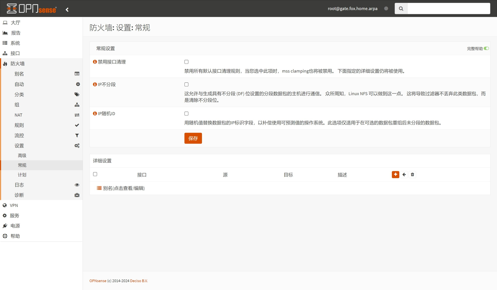
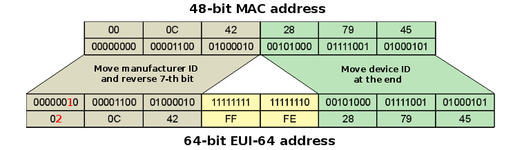
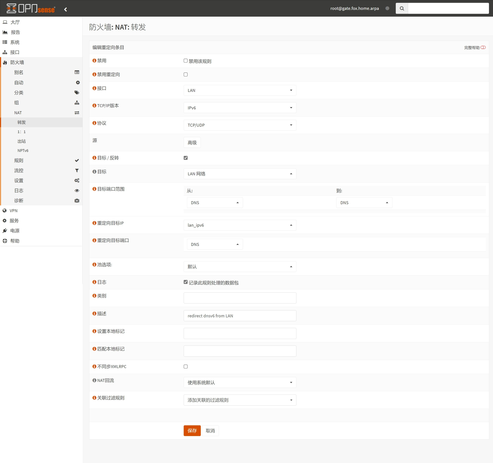
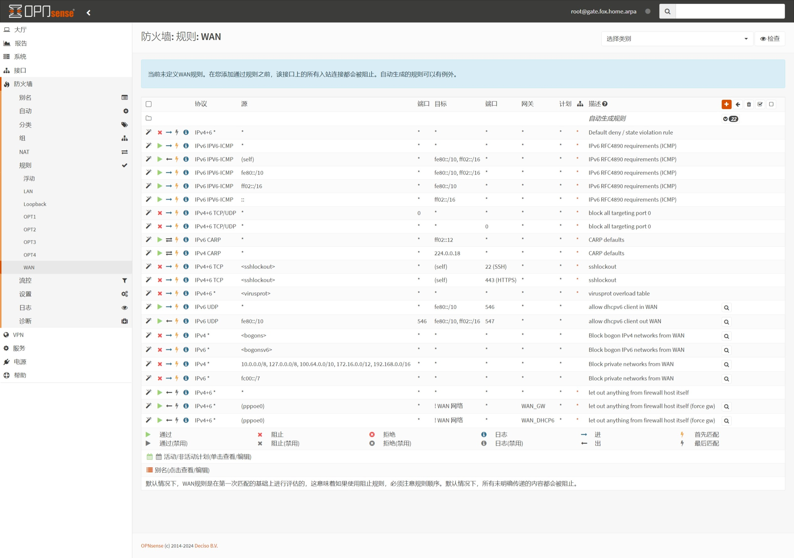

## 1.设置防火墙

在上一篇文章 [08.设置Unbound](./08.设置Unbound.md) 中，已经设置了 `Unbound` 服务，现在来调整防火墙。  

### 1.1.常规设置

登录 OPNsense ，打开左侧导航 `防火墙 - 设置 - 常规` 页面。  

OPNsense 防火墙 `常规设置` 中默认参数适用于大多数场景，如果遇到网络异常，可尝试修改本页配置项。  

### 1.2.高级设置

打开左侧导航 `防火墙 - 设置 - 高级` 页面，防火墙 `高级` 设置如下。  

|配置分组|参数|值|说明|
|--|--|--|--|
|`IPv6选项`|`允许IPv6`|勾选|启用 IPv6 支持|
|`Bogon网络`|`更新频率`|`每周`| `Bogon` 网络地址更新周期|
|`其他`|`禁用回复`|勾选|该参数用于多 WAN 场景，因此建议勾选|
|`Anti DDOS`|`Enable syncookies`|`adaptive`|开启自适应抗 DDoS 攻击|
||`Statetable usage`|`Start 60% - End 30%`|状态表用量阈值，用于自动激活抗 DDoS 攻击|

关于抗 DDoS 攻击设置，参考了 OPNsense 官方论坛：[[Q] How to set adaptive syncookies](https://forum.opnsense.org/index.php?topic=28579.0)  

按需修改完成后，点击页面底部 `保存` 。  

## 2.设置防火墙别名

防火墙中 `别名` 的概念与 RouterOS 防火墙的 `Address Lists` 比较接近，可用于简化防火墙配置。  

### 2.1. IPv4 别名

打开左侧导航 `防火墙 - 别名` 页面，防火墙默认 `别名` 如下。  

这里以添加别名 `lan_ipv4` （ `LAN 接口` 的 IPv4 地址）为演示，点击右下角 ` + ` 按钮，添加防火墙 `别名` 。  

|参数|值|说明|
|--|--|--|
|`启用`|勾选|启用该防火墙别名|
|`名称`|`lan_ipv4`|别名名称，建议使用英文字母填写|
|`类型`|`Host(s)`|设置别名类型|
|`内容`|`172.16.1.1`|支持单个或多个地址|
|`统计数据`|勾选|用于显示别名内包含的地址数量|
|`描述`|`local lan ipv4 address`|描述地址别名内容|

**额外说明：**  

1. 请不要将 IPv4 和 IPv6 地址同时混合填写到 `内容` 参数中。  

2. 在 `内容` 输入框中填写 IP 地址时，按下键盘 `回车键` 即可完成一次输入。  

3. 可在 `内容` 输入框中填写多个 IP 地址，系统会自动识别。  

按需修改完成后，点击对话框右下角 `保存` 并点击页面底部 `应用` 。  

### 2.2. IPv6 别名

**注意：建议在 OPNsense 正确获取运营商前缀后再设置 IPv6 别名。**  

OPNsense 支持使用 IPv6 公网前缀及目标主机的 IPv6 接口标识 **自动** 合成 IPv6 公网地址。  

其中目标主机的 IPv6 接口标识 （ `IPv6 Interface ID` ） 主要包含以下两类：  

1. EUI-64 地址，该地址通过目标主机的 MAC 地址生成，具有唯一性。  

2. 手动设置的，符合 IPv6 地址规范的，在当前子网中具有唯一性的接口标识。  

该功能，在用户需要获取目标主机当前正在使用的 IPv6 公网地址时，提供了便利。  

EUI-64 地址的生成过程如图所示，关于 IPv6 地址更多介绍，请查阅： [RFC4291 - IP Version 6 Addressing Architecture](https://www.rfc-editor.org/rfc/rfc4291)  

这里以添加别名 `lan_ipv6` （ `LAN 接口` 的 IPv6 公网地址）为演示，首先需要获取 `LAN 接口` 的 IPv6 接口标识。  

打开左侧导航 `接口 - 概况` 页面，并点开列表中 `LAN 接口 (lan, bridge0)` 的详情信息。  

可以看到 `LAN 接口` 的 `IPv6本地链路` 和 `IPv6地址` 均包含 `5a9c:fcff:fe10:ffb0` 。  

而这 `5a9c:fcff:fe10:ffb0` ，就是 IPv6 接口标识，需要记录该接口标识以备用。  

回到 `防火墙 - 别名` 页面，点击右下角 ` + ` 按钮，再次添加防火墙 `别名` 。  

|参数|值|说明|
|--|--|--|
|`启用`|勾选|启用该防火墙别名|
|`名称`|`lan_ipv6`|别名名称，建议使用英文字母填写|
|`类型`|`动态IPv6主机`|设置别名类型 |
|`内容`|`::5a9c:fcff:fe10:ffb0`|支持单个或多个地址|
|`接口`|`LAN`|选择接口 `LAN` |
|`统计数据`|勾选|用于显示别名内包含的地址数量|
|`描述`|`local lan ipv6 address`|描述地址别名内容|

**额外说明：**  

1. 每个别名 `名称` 应具有唯一性，不要与其他别名重复。  

2. 在 `内容` 输入框中填写接口标识时，接口标识前面有额外 `::` 符号。  

3. `类型` 为 `动态IPv6主机` 时，需要额外设置 `接口` ，请设置为内网接口。  

按需修改完成后，点击对话框右下角 `保存` 并点击页面底部 `应用` 。  

## 3.设置 DNS 重定向

设置 DNS 重定向后，可让内网 DNS 请求均由 OPNsense 应答，本段内容为可选步骤。  

### 3.1. IPv4 DNS 重定向

打开左侧导航 `防火墙 - NAT - 端口转发` 页面，防火墙默认 `端口转发` 如下。  

这里以添加 `Redirect IPv4 DNS` 规则为演示，点击列表右侧 ` + ` 按钮，添加防火墙规则。  

|参数|值|说明|
|--|--|--|
|`禁用`|**不勾选**|请保持该规则为启用状态|
|`接口`|`LAN`|该规则仅适用于 `LAN` 接口|
|`TCP/IP版本`|`IPv4`|该规则仅适用于 IPv4 |
|`协议`|`TCP/UDP`|该规则适用于 `TCP/UDP` 协议|
|`目标/反转`|**勾选**|设置规则进行反转匹配|
|`目标`|`LAN 网络`|设置需要匹配的目标地址|
|`目标端口范围`|`从 DNS - 到 DNS`|设置需要匹配的目标端口|
|`重定向目标IP`|`lan_ipv4`|设置重定向目标地址|
|`重定向目标端口`|`DNS`|设置重定向目标端口|
|`日志`|勾选|勾选后将在防火墙日志中查看记录|
|`描述`|`Redirect IPv4 DNS`|设置规则的描述信息|

**额外说明：**  

1. 设置 `接口` 参数时，可勾选多个接口，请只保留 `LAN` 接口。  

2. 请不要在 `TCP/IP版本` 中选择 `IPv4+IPv6` ，以避免防火墙行为异常。  

3. 勾选 `目标/反转` 后，代表匹配的目标地址为 “非” `LAN 网络` 。  

4. `目标` 中的 `LAN 网络` 参数是系统默认防火墙别名之一，具体值为 `LAN` 当前内网网段。  

5. `重定向目标IP` 参数可以是具体的 IP 地址，也可以是防火墙别名，例如 `lan_ipv4` 。  

6. `重定向目标端口` 参数，系统默认与 `目标端口范围` 保持一致，也可根据实际需求进行调整。  

按需修改完成后，点击对话框右下角 `保存` 并点击 `应用更改` 。  

### 3.1. IPv6 DNS 重定向

这里以添加 `Redirect IPv6 DNS` 规则为演示，其参数与 `Redirect IPv4 DNS` 基本一致。  

可通过点击列表右侧 ` + ` 按钮进行添加，也可通过规则 `克隆` 功能添加。  

|参数|值|说明|
|--|--|--|
|`禁用`|**不勾选**|请保持该规则为启用状态|
|`接口`|`LAN`|该规则仅适用于 `LAN` 接口|
|`TCP/IP版本`|`IPv6`|该规则仅适用于 IPv6 |
|`协议`|`TCP/UDP`|该规则适用于 `TCP/UDP` 协议|
|`目标/反转`|**勾选**|设置规则进行反转匹配|
|`目标`|`LAN 网络`|设置需要匹配的目标地址|
|`目标端口范围`|`从 DNS - 到 DNS`|设置需要匹配的目标端口|
|`重定向目标IP`|`lan_ipv6`|设置重定向目标地址|
|`重定向目标端口`|`DNS`|设置重定向目标端口|
|`日志`|勾选|勾选后将在防火墙日志中查看记录|
|`描述`|`Redirect IPv6 DNS`|设置规则的描述信息|

按需修改完成后，点击对话框右下角 `保存` 并点击 `应用更改` 。  

此时，防火墙 IPv4/IPv6 DNS 重定向规则设置完成。

至此，OPNsense `防火墙` 设置骤完成。  

## 附录1.防火墙默认规则展示

### 附录1.1. WAN 规则

### 附录1.2. LAN 规则

### 附录1.3. 浮动 规则

### 附录1.4. 环回 规则

### 附录1.5. OPT1 规则

### 附录1.5. OPT2 规则

