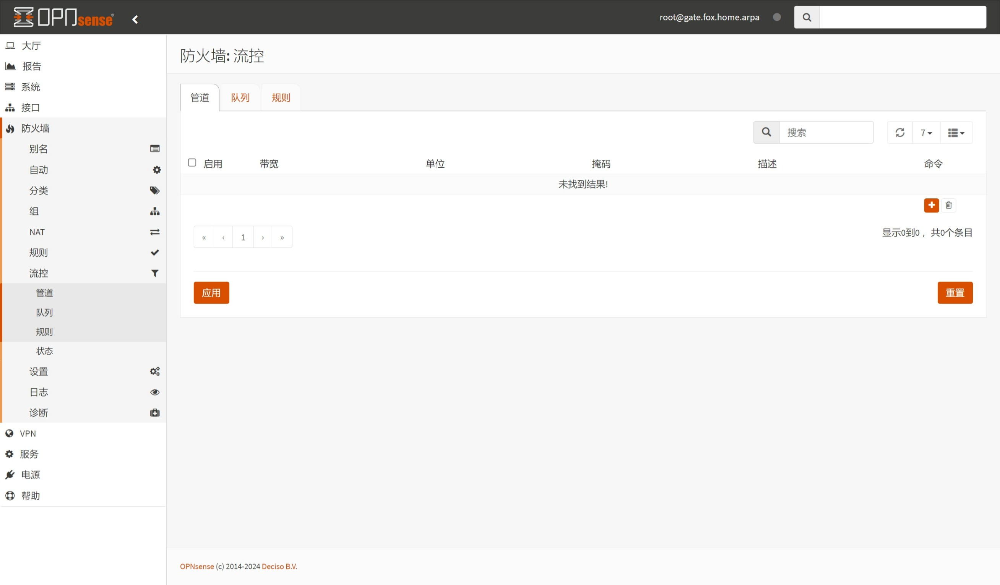
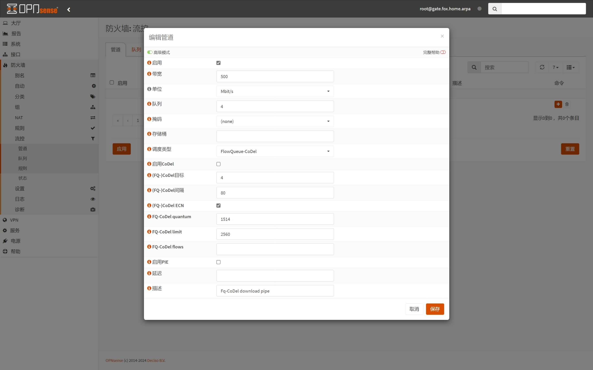
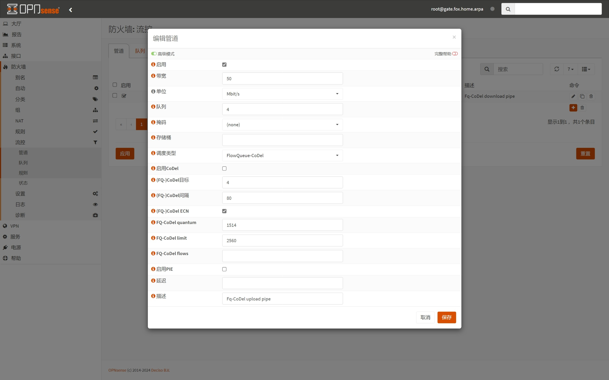
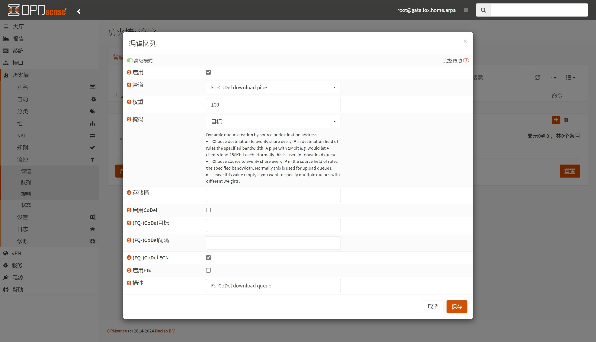
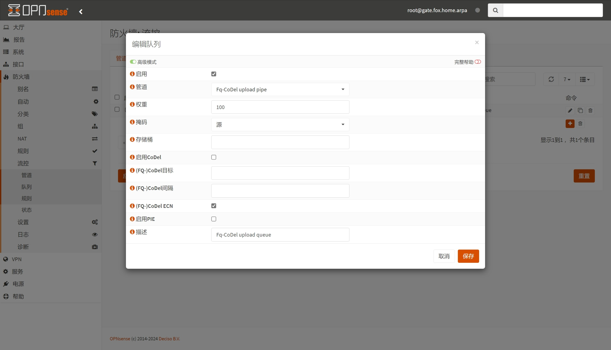
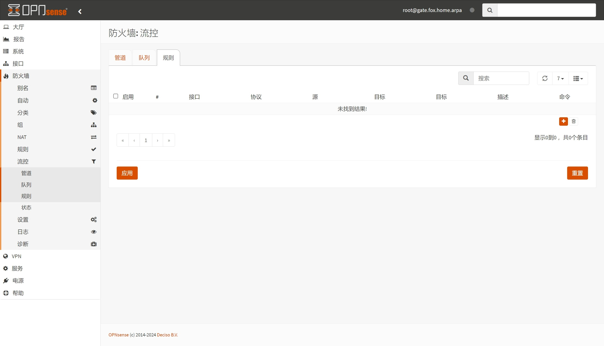
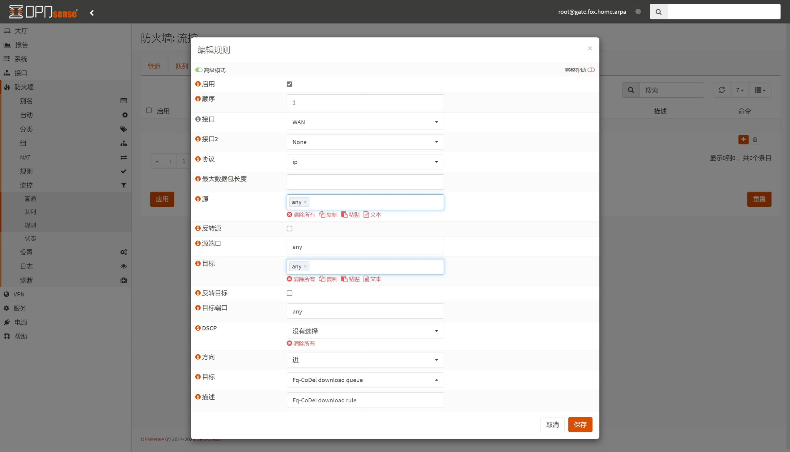
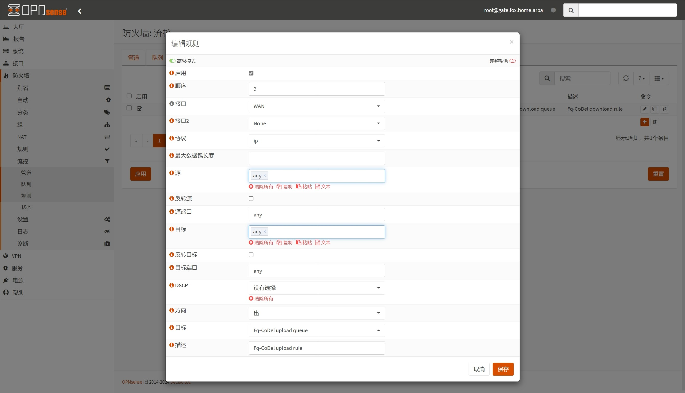

## 1.设置流量整形

在上一篇文章 [09.设置防火墙](./09.设置防火墙.md) 中，已经设置了系统防火墙，现在来设置流量整形 QoS 。  

OPNsense 防火墙对 `Fq-CoDel` 算法的支持较为完善，因此本文主要以该算法为例进行演示。  

### 1.1.管道设置

登录 OPNsense ，打开左侧导航 `防火墙 - 流控 - 管道` 页面。  

流控的 `管道` 可按需设置，但建议至少设置两个，分别针对下载和上传链路。  

点击列表右侧 ` + ` 按钮，给下载链路添加流控 `管道` 。  

|参数|值|说明|
|--|--|--|
|启用|勾选|启用该流控 `管道` |
|带宽|`500`|带宽上限数值|
|单位|`Mbit/s`|带宽单位 `Mbps` |
|队列|`4`|`管道` 中 `队列` 的数量|
|调度类型|`FlowQueue-CoDel`|即 `Fq-CoDel` 算法|
|(FQ-)CoDel 目标|`4`|指定 `Fq-CoDel` 的 `target` 参数，单位为毫秒|
|(FQ-)CoDel 间隔|`80`|指定 `Fq-CoDel` 的 `interval` 参数，单位为毫秒|
|(FQ-)CoDel ECN|勾选|启用 `Fq-CoDel` 的 `ECN` 功能|
|FQ-CoDel quantum|`1514`|指定 `Fq-CoDel` 的 `quantum` 参数|
|FQ-CoDel limit|`2560`|指定 `Fq-CoDel` 的 `limit` 参数|
|描述|`Fq-CoDel download pipe`|该 `管道` 的描述信息|

**额外说明：**  

1. `带宽` 参数，请根据签约带宽或物理接口速率等实际情况调整该数值。  

2. `队列` 参数，一般与 OPNsense 系统的 CPU 核心数相同，但不建议数量少于 `2` 。  

3. `描述` 参数为必填项，后续需要用到这个参数。  

按需修改完成后，点击对话框右下角 `保存` 。  

下载链路的 `管道` 已添加完成，进一步添加上传链路的 `管道` 。  

|参数|值|说明|
|--|--|--|
|启用|勾选|启用该流控 `管道` |
|带宽|`50`|带宽上限数值|
|单位|`Mbit/s`|带宽单位 `Mbps` |
|队列|`4`|`管道` 中 `队列` 的数量|
|调度类型|`FlowQueue-CoDel`|即 `Fq-CoDel` 算法|
|(FQ-)CoDel 目标|`4`|指定 `Fq-CoDel` 的 `target` 参数，单位为毫秒|
|(FQ-)CoDel 间隔|`80`|指定 `Fq-CoDel` 的 `interval` 参数，单位为毫秒|
|(FQ-)CoDel ECN|勾选|启用 `Fq-CoDel` 的 `ECN` 功能|
|FQ-CoDel quantum|`1514`|指定 `Fq-CoDel` 的 `quantum` 参数|
|FQ-CoDel limit|`2560`|指定 `Fq-CoDel` 的 `limit` 参数|
|描述|`Fq-CoDel upload pipe`|该 `管道` 的描述信息|

**额外说明：**  

1. `带宽` 参数，请根据签约带宽或物理接口速率等实际情况调整该数值。  

2. `(FQ-)CoDel ECN` 参数，对于带宽小于 `4Mbps` 的上传链路，可不勾选该选项。  

3. `描述` 参数为必填项，后续需要用到这个参数。  

按需修改完成后，点击对话框右下角 `保存` 并点击页面底部 `应用` 。  

### 1.2.队列设置

切换到 `队列` 页面，进一步指定每个 `管道` 中对应 `队列` 的参数。  

点击列表右侧 ` + ` 按钮，给下载 `管道` 添加流控 `队列` 。  

|参数|值|说明|
|--|--|--|
|启用|勾选|启用该流控 `队列` |
|管道|`Fq-CoDel download pipe`|设置该 `队列` 属于哪个 `管道` |
|权重|`100`|设置该 `队列` 的权重值|
|掩码|`目标`|设置该 `队列` 属于下载链路|
|(FQ-)CoDel ECN|勾选|启用 `Fq-CoDel` 的 `ECN` 功能|
|描述|`Fq-CoDel download queue`|该 `队列` 的描述信息|

**额外说明：**  

1. `掩码` 参数，对于下载链路请使用 `目标` ，对于上传链路请使用 `源` 。  

2. `描述` 参数为必填项，后续需要用到这个参数。  

按需修改完成后，点击对话框右下角 `保存` 。  

下载 `管道` 的 `队列` 已添加完成，进一步添加上传 `管道` 的 `队列` 。  

|参数|值|说明|
|--|--|--|
|启用|勾选|启用该流控 `队列` |
|管道|`Fq-CoDel upload pipe`|设置该 `队列` 属于哪个 `管道` |
|权重|`100`|设置该 `队列` 的权重值|
|掩码|`源`|设置该 `队列` 属于上传链路|
|(FQ-)CoDel ECN|勾选|启用 `Fq-CoDel` 的 `ECN` 功能|
|描述|`Fq-CoDel upload queue`|该 `队列` 的描述信息|

按需修改完成后，点击对话框右下角 `保存` 并点击页面底部 `应用` 。  

### 1.3.规则设置

切换到 `规则` 页面，进一步指定每个 `队列` 中对应 `规则` 的参数。  

点击列表右侧 ` + ` 按钮，给下载 `队列` 添加流控 `规则` 。  

|参数|值|说明|
|--|--|--|
|启用|勾选|启用该流控 `规则` |
|接口|`WAN`|指定该 `规则` 应用于哪个接口|
|方向|`进`|指定该 `规则` 用于下载链路|
|目标|`Fq-CoDel download queue`|指定该 `规则` 属于哪个 `队列`|
|描述|`Fq-CoDel download rule`|该 `规则` 的描述信息|

**额外说明：**  

1. `接口` 参数，对于下载和上传链路均设置为 `WAN` 接口。  

2. `方向` 参数，下载链路请使用 `进` ，对于上传链路请使用 `出` 。  

3. `描述` 参数为必填项。  

按需修改完成后，点击对话框右下角 `保存` 。  

下载 `队列` 的 `规则` 已添加完成，进一步添加上传 `队列` 的 `规则` 。  

|参数|值|说明|
|--|--|--|
|启用|勾选|启用该流控 `规则` |
|接口|`WAN`|指定该 `规则` 应用于哪个接口|
|方向|`出`|指定该 `规则` 用于上传链路|
|目标|`Fq-CoDel upload queue`|指定该 `规则` 属于哪个 `队列`|
|描述|`Fq-CoDel upload rule`|该 `规则` 的描述信息|

按需修改完成后，点击对话框右下角 `保存` 并点击页面底部 `应用` 。  

至此，OPNsense `流量整形` 设置骤完成。  

