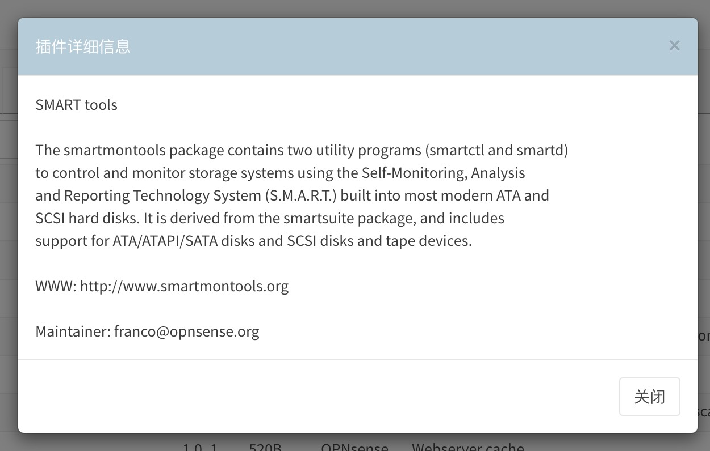
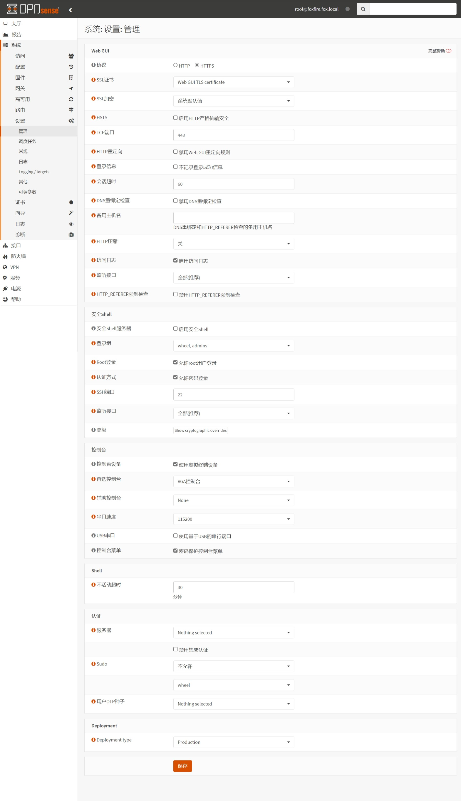
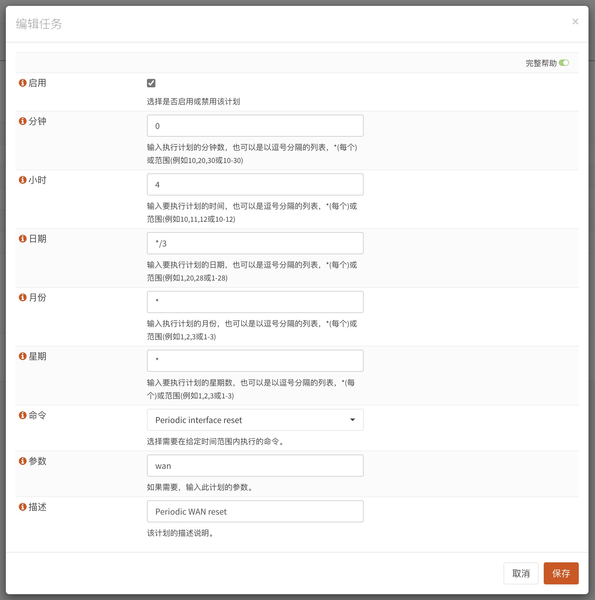
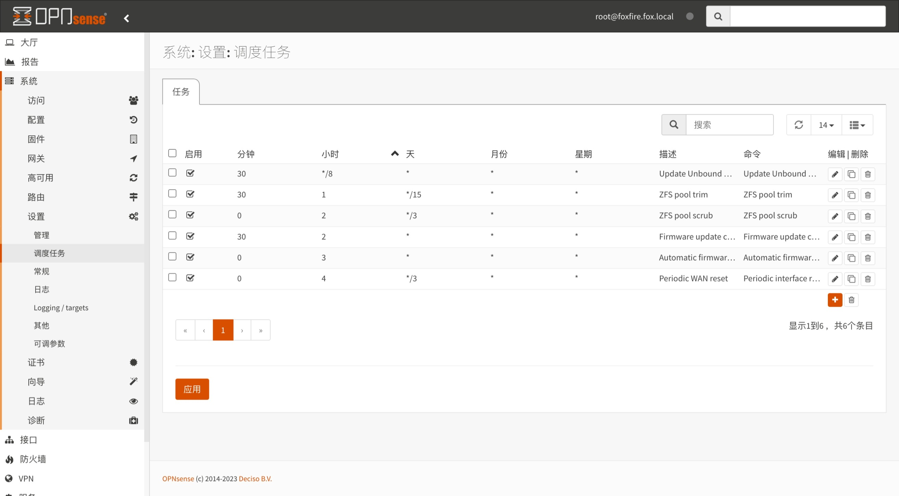
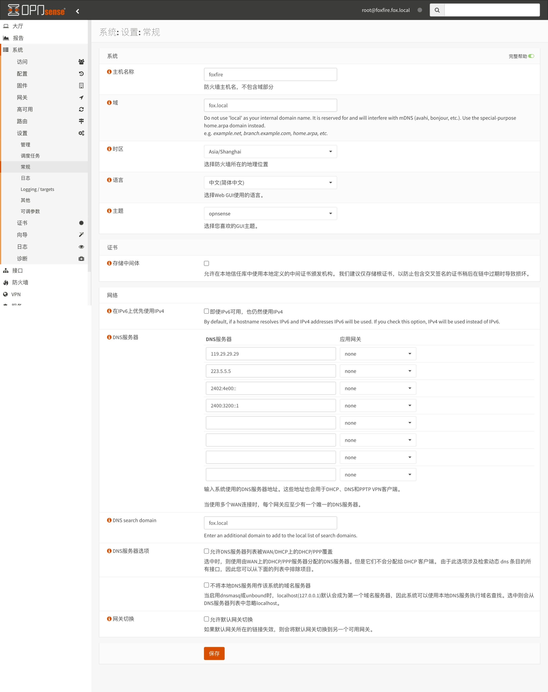
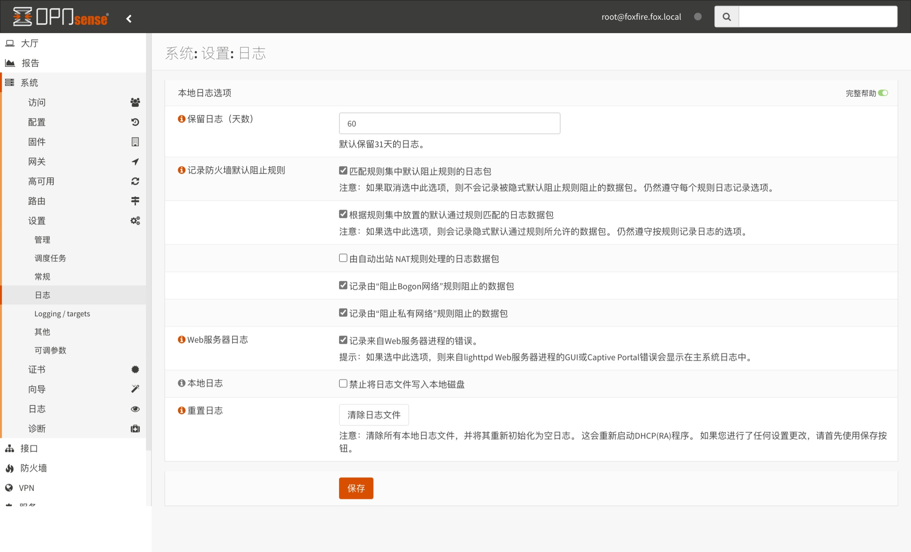
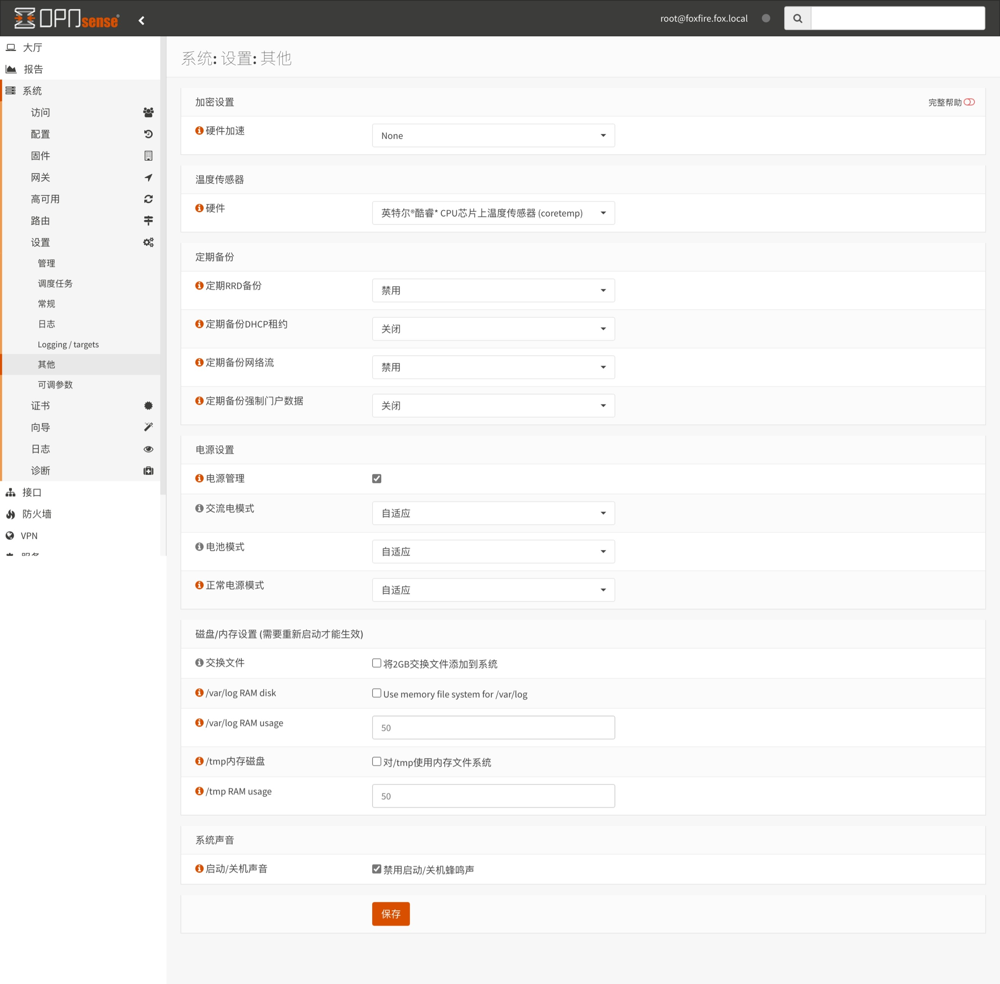
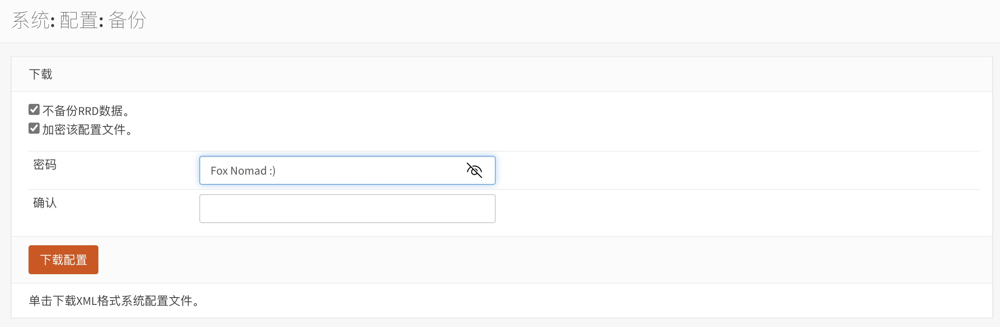

## 1.设置系统固件

在上一篇文章 [09.设置防火墙](./09.设置防火墙.md) 中，已经设置了系统防火墙，现在来调整 OPNsense 系统。  

### 1.1.系统镜像

登录 OPNsense ，打开左侧导航 `系统 - 固件 - 设置` 页面。  

`镜像` 设置为 `(other)` ，此时系统会显示额外输入框，允许用户自定义系统镜像。  

在对话框中输入 OPNsense 镜像站地址，这里以 `北京大学镜像站` 地址为例，并点击 `保存` 。  

**注意：镜像地址链接结尾处，不要有多余的符号 `/` 。**  

```bash
## 北京大学镜像站
https://mirrors.pku.edu.cn/opnsense

## 北京外国语大学镜像站
https://mirrors.bfsu.edu.cn/opnsense
```


### 1.2.系统插件

打开左侧导航 `系统 - 固件 - 插件` 页面。  

物理机安装 OPNsense 时，推荐安装 `os-smart` ，点击插件右侧 ` + ` 按钮即可安装。  



## 2.设置系统参数

### 2.1.管理

打开左侧导航 `系统 - 设置 - 管理` 页面，系统 `管理` 设置如下。  

|配置分组|参数|值|说明|
|--|--|--|--|
|Web GUI|会话超时|`60`|设置 Web GUI 会话超时为 `60` 分钟|
||访问日志|勾选|记录 OPNsense 登录日志|
||监听接口|`全部（推荐）`|设置 Web GUI 监听接口|
|安全 Shell|安全 Shell 服务器|勾选|按需启用，允许使用 SSH 登录 OPNsense |
||Root 登录|勾选|允许 `root` 账户登录 |
||认证方式|勾选|允许 `root` 账户使用密码登录 |
||监听接口|`全部（推荐）`|设置 SSH 服务监听接口|
|控制台|密码保护控制台菜单|勾选|激活 OPNsense 控制台菜单时，将需要密码验证|
|Shell|不活动超时|`30`|`shell` 的空闲会话超时|
|Deployment|Deployment type|`Production`|以生产模式部署 OPNsense |

按需修改完成后，点击页面底部 `保存` 。  



### 2.2.调度任务

打开左侧导航 `系统 - 设置 - 调度任务` 页面。  

这里以设置 `Periodic interface reset` 为演示，点击右下角 ` + ` 按钮，添加 `调度任务` 。  

|参数|值|说明|
|--|--|--|
|启用|勾选|启用该调度任务|
|分钟|`0`|任务执行的时间点|
|小时|`4`|任务执行的时间点|
|日期|`*/3`|任务执行的时间点|
|月份|`*`|任务执行的时间点|
|星期|`*`|任务执行的时间点|
|命令|`Periodic interface reset`|任务执行时所使用的命令|
|参数|`wan`|任务执行时所使用命令的参数|
|描述|`Periodic WAN reset`|任务描述|

**额外说明：**  

1. 并非每个 `调度任务` 都需要 `参数` ，具体参见表格。  

|启用|分钟|小时|日期|月份|星期|命令|参数|描述|
|--|--|--|--|--|--|--|--|--|
|是|`30`|`*/8`|`*`|`*`|`*`|`Update Unbound DNSBLs`||Update Unbound DNSBLs|
|是|`30`|`1`|`*/15`|`*`|`*`|`ZFS pool trim`||ZFS pool trim|
|是|`0`|`2`|`*/3`|`*`|`*`|`ZFS pool scrub`||ZFS pool scrub|
|是|`30`|`2`|`*`|`*`|`*`|`Firmware update check`||Firmware update check|
|是|`0`|`3`|`*`|`*`|`*`|`Automatic firmware update`||Automatic firmware update|
|是|`0`|`4`|`*/3`|`*`|`*`|`Periodic interface reset`|`wan`|Periodic WAN reset|
|是|`30`|`4`|`*`|`*`|`*`|`Restart Unbound DNS service`||Restart Unbound DNS service|

按需修改完成后，点击对话框右下角 `保存` 并点击页面底部 `应用` 。  



可按需添加多个 `调度任务` ，添加完成后如图所示。  



### 2.3.常规

打开左侧导航 `系统 - 设置 - 常规` 页面，系统 `常规` 设置如下。  

|配置分组|参数|值|说明|
|--|--|--|--|
|系统|主机名称|`gate`|系统主机名|
||域|`fox.home.arpa`|系统本地域名|
||时区|`Asia/Shanghai`|系统本地时区|
||语言|`中文(简体中文)`|系统 WEB 界面语言|
||主题|`opnsense`|系统 WEB 界面主题配色|
|网络|在 IPv6 上优先使用 IPv4|**不勾选**|是否在 IPv6 可用时仍然使用 IPv4 |
||DNS 服务器|（填写公共 DNS 服务器）|OPNsense 备用 DNS 服务器|
||应用网关|`none`|适用于多 `WAN` 场景，保持默认即可|
||DNS search domain|`fox.home.arpa`|与系统本地域名保持一致|
||DNS 服务器选项|**不勾选**|避免使用 `Unbound` 以外的 DNS 服务器|

按需修改完成后，点击页面底部 `保存` 。  



### 2.4.日志

打开左侧导航 `系统 - 设置 - 日志` 页面。  

请根据 OPNsense 业务繁忙程度以及硬盘可用空间来设置 `日志` 的保留天数。  

按需修改完成后，点击页面底部 `保存` 。  



### 2.5.其他

打开左侧导航 `系统 - 设置 - 其他` 页面，系统 `其他` 设置如下。  

|配置分组|参数|值|说明|
|--|--|--|--|
|温度传感器|硬件|`英特尔 CPU coretemp`|物理机安装 OPNsense 时启用|
|电源设置|电源管理|勾选|物理机安装 OPNsense 时启用|
||交流电模式|`自适应`|保持默认即可|
||电池模式|`自适应`|保持默认即可|
||正常电源模式|`自适应`|保持默认即可|
|系统声音|启动/关机声音|勾选|推荐物理机安装 OPNsense 时启用|

按需修改完成后，点击页面底部 `保存` 。  



## 3.备份系统

打开左侧导航 `系统 - 配置 - 备份` 页面，在系统调整完毕后可将系统备份。  



至此，OPNsense 系统调整骤完成。  

